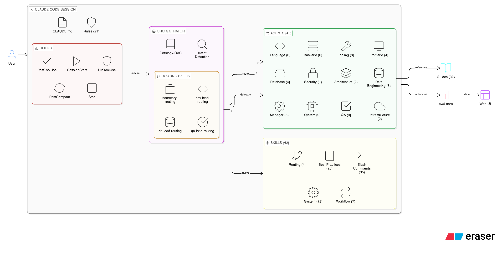
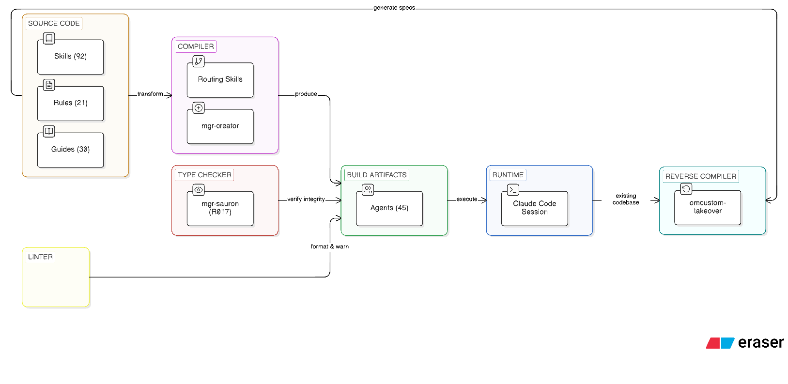
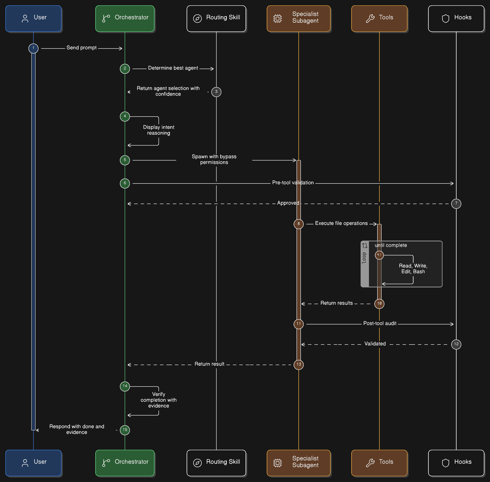
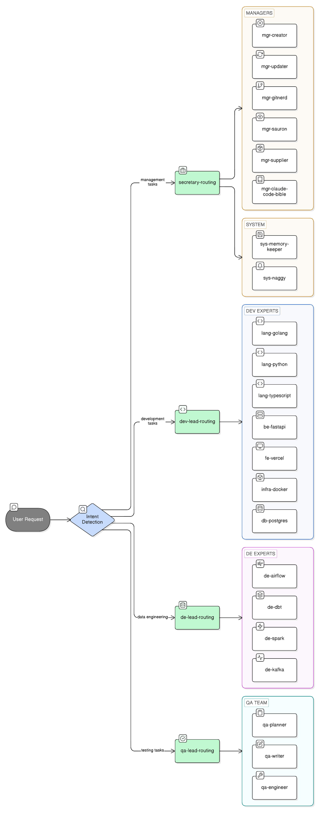
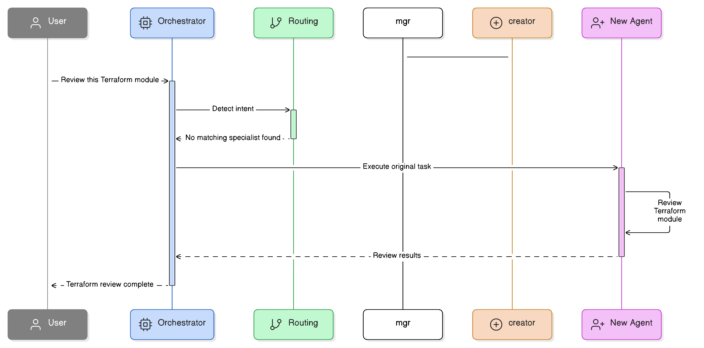
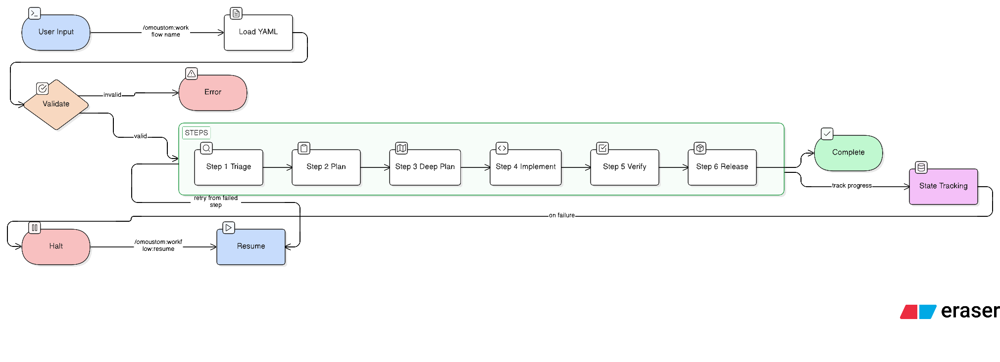
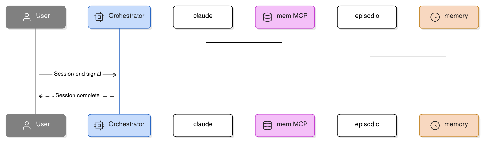
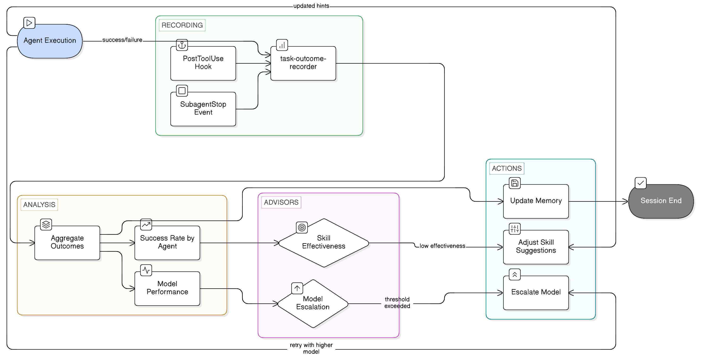
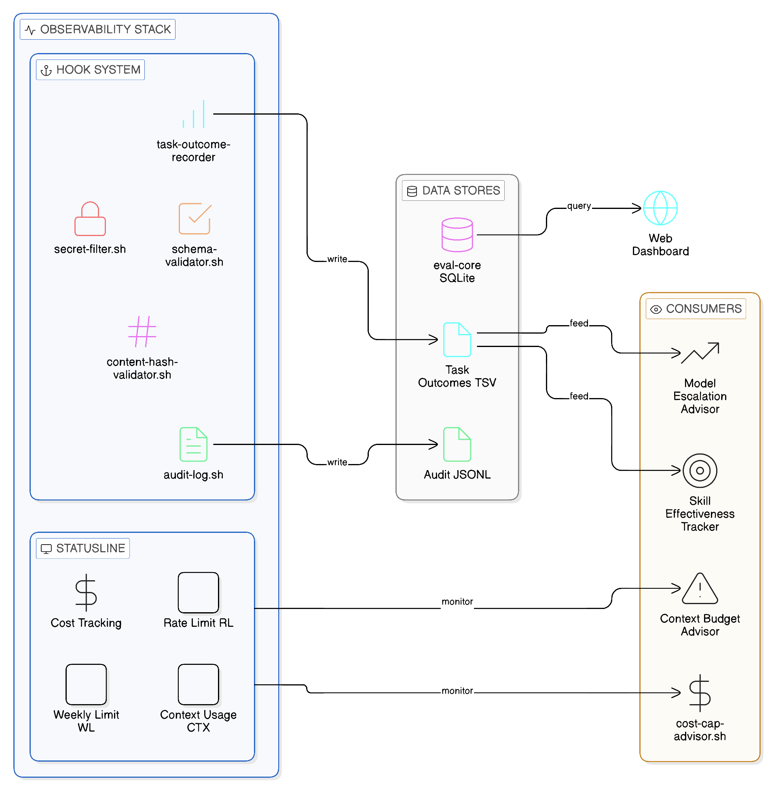
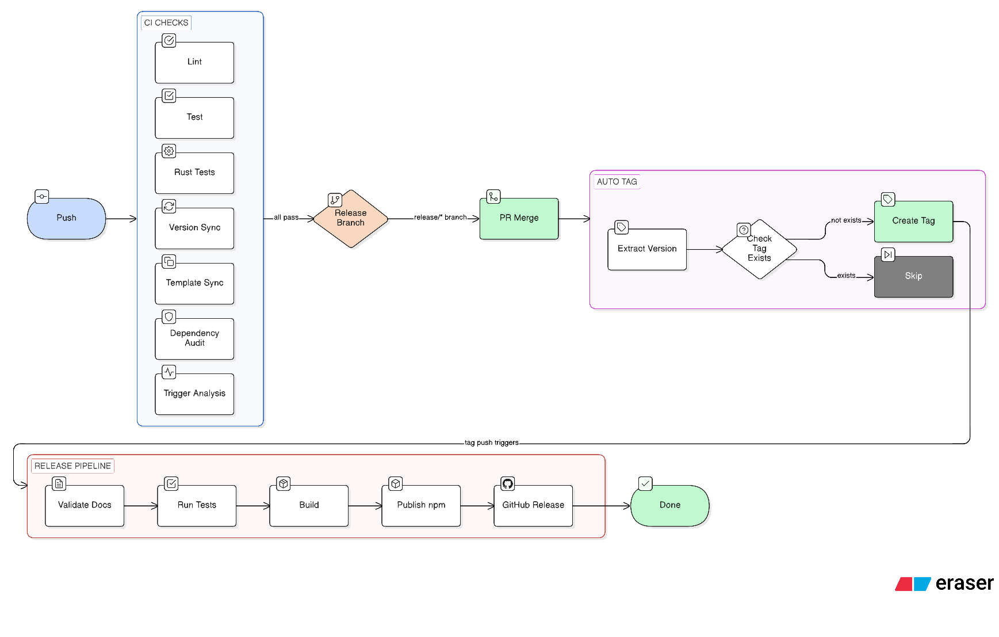

# Architecture

> oh-my-customcode v0.62.5

## 1. System Overview

oh-my-customcode is a batteries-included agent harness for Claude Code. It ships 46 pre-built subagents, 97 skills, 21 governing rules, and a comprehensive hook system — all wired together so that any Claude Code session inherits a complete multi-agent operating model without additional configuration. The core philosophy is: **"No expert? CREATE one, connect knowledge, and USE it."** When a task arrives with no matching specialist, the system auto-creates one by discovering relevant skills and guides, then immediately executes the task.

The harness operates on three engineering pillars — **Context Engineering** (what goes into the prompt), **Architectural Constraints** (rules that shape agent behavior), and **Entropy Management** (hooks, verification, and observability that keep the system coherent at scale).

Current version: **0.62.5** — distributed as `oh-my-customcode` on npm, CLI: `omcustom`.

---

## 2. High-Level Architecture

<p align="center">
  
</p>

### 2.1 Compilation Metaphor

oh-my-customcode treats agent harness authoring as a compilation problem. Skills, rules, and guides are "source code" that compiles into agent behavior at runtime. This metaphor drives several design decisions:

| Compilation Concept | Harness Equivalent |
|--------------------|--------------------|
| Source code | Skills (SKILL.md), Rules (.claude/rules/), Guides (guides/) |
| Compiler | Routing skills + mgr-creator (transforms specs into agent prompts) |
| Linker | Orchestrator (connects agent outputs into coherent workflows) |
| Runtime | Claude Code session (executes the compiled agent system) |
| Type checker | mgr-sauron (R017 verification — validates structural integrity) |
| Linter | Pre/PostToolUse hooks (advisory warnings, format enforcement) |
| Reverse compiler | omcustom-takeover skill (code to spec reverse compilation) |

The takeover pattern — reverse-compiling an existing codebase into structured specs that can then drive agent creation — is a core capability for onboarding new projects.

<p align="center">
  
</p>

---

## 3. Component Inventory

### 3.1 Rule System (R000–R021, no R014)

| ID | Priority | Name | Description |
|----|----------|------|-------------|
| R000 | MUST | Language Policy | Korean I/O, English files, delegation model |
| R001 | MUST | Safety Rules | Prohibited actions, destructive-op gates |
| R002 | MUST | Permissions | Tool tier policy, file access scope |
| R003 | SHOULD | Interaction Rules | Response principles, status format |
| R004 | SHOULD | Error Handling | Error levels, recovery strategies |
| R005 | MAY | Optimization | Efficiency, token optimization |
| R006 | MUST | Agent Design | Agent file format, separation of concerns, soul identity |
| R007 | MUST | Agent Identification | Every response starts with agent header |
| R008 | MUST | Tool Identification | Every tool call includes agent+model prefix |
| R009 | MUST | Parallel Execution | 2+ independent tasks MUST run in parallel |
| R010 | MUST | Orchestrator Coordination | Orchestrator never writes files directly |
| R011 | SHOULD | Memory Integration | Native auto-memory + MCP supplementary, temporal decay |
| R012 | SHOULD | HUD Statusline | Real-time session status display |
| R013 | SHOULD | Ecomode | Task-type-aware context budget thresholds |
| R015 | MUST | Intent Transparency | Display routing reasoning before execution |
| R016 | MUST | Continuous Improvement | Rule violation -> update rule -> continue |
| R017 | MUST | Sync Verification | 5+3 round verification before push |
| R018 | MUST (conditional) | Agent Teams | Mandatory when CLAUDE_CODE_EXPERIMENTAL_AGENT_TEAMS=1 |
| R019 | SHOULD | Ontology-RAG Routing | Enriches agent selection with contextual skill suggestions |
| R020 | MUST | Completion Verification | Task-type-specific verification before declaring [Done] |
| R021 | MUST | Enforcement Policy | Advisory-first enforcement model, promotion criteria |

### 3.2 Agent Taxonomy (46 agents)

| Category | Count | Agents |
|----------|-------|--------|
| SW Engineer / Language | 6 | lang-golang-expert, lang-python-expert, lang-rust-expert, lang-kotlin-expert, lang-typescript-expert, lang-java21-expert |
| SW Engineer / Backend | 6 | be-fastapi-expert, be-springboot-expert, be-go-backend-expert, be-express-expert, be-nestjs-expert, be-django-expert |
| SW Engineer / Frontend | 5 | fe-vercel-agent, fe-vuejs-agent, fe-svelte-agent, fe-flutter-agent, fe-design-expert |
| SW Engineer / Tooling | 3 | tool-npm-expert, tool-optimizer, tool-bun-expert |
| Data Engineering | 6 | de-airflow-expert, de-dbt-expert, de-spark-expert, de-kafka-expert, de-snowflake-expert, de-pipeline-expert |
| Database | 4 | db-supabase-expert, db-postgres-expert, db-redis-expert, db-alembic-expert |
| Security | 1 | sec-codeql-expert |
| Architecture | 2 | arch-documenter, arch-speckit-agent |
| Infrastructure | 2 | infra-docker-expert, infra-aws-expert |
| QA | 3 | qa-planner, qa-writer, qa-engineer |
| Manager | 6 | mgr-creator, mgr-updater, mgr-supplier, mgr-gitnerd, mgr-sauron, mgr-claude-code-bible |
| System | 2 | sys-memory-keeper, sys-naggy |
| **Total** | **46** | |

Each agent is defined in `.claude/agents/{name}.md` with YAML frontmatter specifying model, tools, skills, memory scope, and optional features (soul identity, escalation policy, isolation mode).

### 3.3 Skill Catalog (97 skills)

**Routing skills (4, context: fork)**

| Skill | Routes To |
|-------|-----------|
| secretary-routing | mgr-* and sys-* agents |
| dev-lead-routing | lang-*, be-*, fe-*, tool-*, db-*, arch-*, infra-* agents |
| de-lead-routing | de-* agents |
| qa-lead-routing | qa-* agents |

**Workflow/orchestration skills (7, context: fork)**

dag-orchestration, task-decomposition, worker-reviewer-pipeline, pipeline-guards, deep-plan, evaluator-optimizer, sauron-watch

**Best-practices skills (~26)**

go-best-practices, go-backend-best-practices, python-best-practices, rust-best-practices, kotlin-best-practices, typescript-best-practices, java21-best-practices, react-best-practices, web-design-guidelines, fastapi-best-practices, springboot-best-practices, django-best-practices, flutter-best-practices, docker-best-practices, aws-best-practices, postgres-best-practices, supabase-postgres-best-practices, redis-best-practices, kafka-best-practices, dbt-best-practices, spark-best-practices, snowflake-best-practices, airflow-best-practices, pipeline-architecture-patterns, vercel-deploy, writing-clearly-and-concisely

**Slash command / user-invocable skills**

analysis, create-agent, update-docs, update-external, audit-agents, fix-refs, dev-review, dev-refactor, memory-save, memory-recall, monitoring-setup, npm-publish, npm-version, npm-audit, codex-exec, optimize-analyze, optimize-bundle, optimize-report, research, deep-plan, sauron-watch, structured-dev-cycle, omcustom-release-notes, omcustom-takeover, lists, status, help, adversarial-review, ambiguity-gate, scout, professor-triage, release-plan, deep-verify, omcustom-workflow, omcustom-workflow-resume, improve-report, omcustom-feedback, omcustom-web, omcustom-loop, sdd-dev

**System / internal skills**

intent-detection, model-escalation, stuck-recovery, result-aggregation, multi-model-verification, pr-auto-improve, memory-management, claude-code-bible, cve-triage, jinja2-prompts, skills-sh-search, reasoning-sandwich, evaluator-optimizer, systematic-debugging, workflow-runner, alembic-best-practices, action-validator, peer-messaging

### 3.4 Guide Library (31 topics)

| Category | Guides |
|----------|--------|
| Internal | claude-code, git-worktree-workflow, skill-bundle-design |
| Language | golang, python, rust, kotlin, typescript, java21 |
| Frontend | flutter, web-design |
| Backend | fastapi, springboot, go-backend, django-best-practices |
| Infrastructure | docker, aws |
| Data Engineering | airflow, dbt, kafka, spark, snowflake, iceberg |
| Database | supabase-postgres, postgres, redis, alembic, drizzle-orm |
| Writing | elements-of-style |
| Web Scraping | web-scraping |

### 3.5 Hook System

The hook system provides cross-cutting concerns across all agent operations. Hooks are advisory-only by design: PostToolUse hooks record state, PreToolUse hooks advise, but neither blocks execution (except stage-blocker and dev-server tmux enforcement).

| Event | Scripts / Handlers | Purpose |
|-------|--------------------|---------|
| SessionStart | session-env-check.sh, stale-todo-scanner.sh | Detect codex CLI + Agent Teams availability; scan for stale TODOs |
| PreToolUse (Write/Edit) | stage-blocker.sh | Block writes outside implement stage |
| PreToolUse (Bash dev server) | inline script | Force dev servers into tmux |
| PreToolUse (Edit) | content-hash-validator.sh | Advisory staleness warning via content hash |
| PreToolUse (Write/Edit/Bash) | schema-validator.sh | Schema-based tool input validation (advisory) |
| PreToolUse (Agent/Task) | HUD display, git-delegation-guard.sh, agent-teams-advisor.sh, model-escalation-advisor.sh | Spawn display, R010 enforcement, R018 advisory, escalation advisory |
| PostToolUse (Edit TS/JS) | prettier, tsc, console.log detector | Auto-format + type-check JS/TS |
| PostToolUse (Edit Go) | gofmt | Auto-format Go files |
| PostToolUse (Edit Py) | ruff, ty | Auto-format + type-check Python |
| PostToolUse (Bash) | PR URL logger | Log PR URL after `gh pr create` |
| PostToolUse (Agent/Task) | task-outcome-recorder.sh | Record outcomes for model escalation |
| PostToolUse (Read) | content-hash-validator.sh | Store content hashes for staleness detection |
| PostToolUse (Bash/Read) | secret-filter.sh | Detect potential secrets in output (advisory) |
| PostToolUse (Edit/Write/Bash/Agent) | audit-log.sh | Append-only audit log for state-changing operations |
| PostToolUse (any tool) | context-budget-advisor.sh, stuck-detector.sh, cost-cap-advisor.sh | Ecomode advisory, loop detection, cost monitoring |
| PostCompact | compact-rules-reinforcement (inline) | Re-inject R007/R008/R009/R010/R018 identity and delegation rules after context compaction |
| SubagentStart | HUD inline display | Log agent type:model when subagent starts |
| SubagentStop | task-outcome-recorder.sh | Record final outcome |
| Stop | stop-console-audit.sh, eval-core-batch-save.sh, feedback-collector.sh, R011 prompt | Final audit, batch evaluation save, session feedback extraction and improvementActions insert, memory checkpoint |

#### Observability Hooks (Harness Engineering)

Four hooks form the observability backbone, added as part of the Harness Engineering adoption:

| Hook | Type | Description |
|------|------|-------------|
| audit-log.sh | PostToolUse | Append-only audit trail of all state-changing tool calls (Edit, Write, Bash, Agent). Writes to `/tmp/.claude-audit-$PPID.jsonl`. |
| secret-filter.sh | PostToolUse | Pattern-based detection of secrets (API keys, tokens, passwords) in Bash/Read output. Advisory warning only. |
| schema-validator.sh | PreToolUse | Validates tool input structure against expected schemas. Phase 1 advisory mode. |
| content-hash-validator.sh | Pre+PostToolUse | Stores MD5 hashes on Read, warns on Edit if file changed since last Read (stale edit detection). |

---

## 4. Orchestration Pattern

### 4.1 Singleton Orchestrator (R010)

The main conversation is the **sole orchestrator**. It coordinates via routing skills and the Agent tool. It NEVER writes or edits files directly — all file mutations are delegated to subagents. The only exception: Agent Teams members act as local orchestrators for their own sub-tasks and CAN spawn sub-agents.

<p align="center">
  
</p>

### 4.2 Routing Architecture

<p align="center">
  
</p>

### 4.3 Ontology-RAG Enrichment (R019)

After static routing selects an agent, the orchestrator optionally calls `get_agent_for_task(query)` via MCP to extract `suggested_skills`. These are prepended to the spawned agent's prompt as contextual hints. MCP failure is silently ignored — Ontology-RAG is advisory only and never blocks routing.

Known limitation: `context: fork` skills cannot access MCP tools, so `get_agent_for_task` in routing SKILL.md files is effectively dead letter. The call must be made at the orchestrator level before spawning the agent.

### 4.4 Dynamic Agent Creation

When routing detects no matching specialist:

<p align="center">
  
</p>

### 4.5 Intent Detection (R015)

Intent is scored before routing is executed:

| Factor | Weight |
|--------|--------|
| Keywords | 40% |
| File patterns | 30% |
| Action verbs | 20% |
| Context (prior agent, cwd) | 10% |

| Confidence | Action |
|------------|--------|
| >= 90% | Auto-execute, display intent block |
| 70-89% | Request confirmation, show alternatives |
| < 70% | List options for user to choose |

### 4.6 Completion Verification (R020)

Before declaring any task `[Done]`, the orchestrator (or subagent) must verify completion against task-type-specific criteria. This prevents false completion declarations that erode trust and cause downstream failures.

| Task Type | Required Verification |
|-----------|----------------------|
| Release | All issues closed, version bumped, PR merged, GitHub Release created |
| Implementation | Code compiles/passes lint, tests pass, no TODO markers left |
| Documentation | Links valid, counts accurate, cross-references updated |
| Git Operations | Operation succeeded (check exit code), working tree clean |
| Code Review | All findings addressed or explicitly deferred |
| Agent/Skill Creation | Frontmatter valid, referenced skills exist, routing updated |

Complex tasks declare a **Completion Contract** upfront with specific, verifiable criteria, then report evidence for each criterion at completion.

---

## 5. Execution Patterns

### 5.1 Parallel Execution (R009)

Two or more independent tasks MUST run in parallel (max 4 concurrent). Sequential execution of parallelizable tasks is a rule violation.

```
Agent(task-1):sonnet   ┐
Agent(task-2):sonnet   ├─ Single message — all spawned together
Agent(task-3):haiku    │
Agent(task-4):haiku    ┘
```

Large tasks exceeding 3 minutes MUST be split into parallel sub-tasks. Before spawning 2+ agents, Agent Teams eligibility must be evaluated (see 5.2). Each parallel spawn includes a `[N]` prefix in the Agent `description` parameter for correlation with the Running display (R008).

### 5.2 Agent Teams (R018, conditional)

Active when `CLAUDE_CODE_EXPERIMENTAL_AGENT_TEAMS=1`. When enabled and criteria are met, use is MANDATORY.

| Criteria | Agent Tool | Agent Teams (MUST) |
|----------|-----------|-------------------|
| 1-2 agents, independent | Yes | |
| 3+ agents | | Yes |
| Review -> fix -> re-review cycle | | Yes |
| Shared state / coordination needed | | Yes |
| Cost-sensitive batch ops | Yes | |

Lifecycle: `TeamCreate -> TaskCreate -> Agent(spawn all members in one message) -> SendMessage -> TaskUpdate -> TeamDelete`

Agent Teams members are peers, not hierarchical subagents. Members CAN spawn sub-agents via the Agent tool to execute complex workflows (R010 exception). This enables teams-compatible skills like `/research` and `/deep-plan` to run inside team members.

### 5.3 Evaluator-Optimizer Pattern

The evaluator-optimizer skill implements an iterative refinement loop:


The generator produces output, the evaluator scores it against criteria, and failures loop back with specific feedback until quality thresholds are met. This pattern underpins code review cycles, agent creation validation, and research synthesis.

### 5.4 Research Pattern (/research)

10 research teams across 5 domains, executed in 3 batches per R009:

```
Batch 1: T1(Arch-breadth), T2(Arch-depth), T3(Sec-breadth), T4(Sec-depth)
Batch 2: T5(Intg-breadth), T6(Intg-depth), T7(Comp-breadth), T8(Comp-depth)
Batch 3: T9(Innov-breadth), T10(Innov-depth)

Phase 2: Cross-verification (2-5 rounds, opus + codex-exec)
Phase 3: Synthesis (opus) -> ADOPT / ADAPT / AVOID taxonomy
Phase 4: Structured report + GitHub issue
```

When Agent Teams is enabled, research teams run as team members with peer-to-peer messaging for cross-verification, rather than isolated subagents.

### 5.5 Deep Plan Pattern (/deep-plan)

Three-phase planning with research validation:

```
Phase 1: /research on the problem domain
Phase 2: Plan generation informed by research findings
Phase 3: Plan verification against research constraints
```

The deep-plan skill is teams-compatible (`teams-compatible: true` in frontmatter) and runs inside Agent Teams members when the feature is enabled.

### 5.6 Structured Development Cycle (/structured-dev-cycle)

Six-stage gated workflow:

```
Plan -> Verify -> Implement -> Verify -> Compound -> Done
```

The stage-blocker hook enforces Write/Edit restrictions outside the implement stage. Each stage transition requires explicit verification.

### 5.7 Reasoning Sandwich

The reasoning-sandwich skill structures prompts with context-instruction-context layering to maximize model attention on critical information. It is an internal skill used by routing and orchestration workflows to improve prompt effectiveness.

### 5.8 Workflow Engine (/omcustom:workflow)

<p align="center">
  
</p>

YAML-defined workflow pipelines in `workflows/` directory. Each workflow defines sequential steps that invoke skills or actions.

Available workflows:
- `auto-dev` — Full-auto release pipeline: triage → plan → implement → verify → PR

Custom workflows can be defined by users in `workflows/` with any `^[a-z0-9-]+$` name.

### 5.9 Professor Triage (/professor-triage)

Cross-analyzes GitHub issues with omc_issue_analyzer comments. 6-phase workflow:
1. Collect `professor` labeled issues
2. Fetch omc_issue_analyzer comments for each
3. Independent codebase verification
4. Cross-analyze: compare analyzer claims vs actual code
5. Post findings as issue comments
6. Apply labels (verify-done, priority adjustments)

### 5.10 Release Plan (/release-plan)

Collects verify-done issues, groups by priority and size into release units. Generates structured release plan documents with implementation order and agent suggestions.

### 5.11 Autonomous Mode (R010)

When user signals full-delegation intent ("진행시켜", "알아서 해"), the orchestrator operates in lightweight mode: file write/edit delegation still required, but simple git operations and confirmation gates are relaxed.

---

## 6. Memory Architecture

### 6.1 Native Auto-Memory

Enabled by `memory:` field in agent frontmatter. The system creates a memory directory and injects the first 200 lines of `MEMORY.md` into the agent's system prompt.

| Scope | Location | Git Tracked |
|-------|----------|-------------|
| `user` | `~/.claude/agent-memory/<name>/` | No |
| `project` | `.claude/agent-memory/<name>/` | Yes |
| `local` | `.claude/agent-memory-local/<name>/` | No |

### 6.2 Confidence-Tracked Memory

Memory entries carry confidence annotations to distinguish verified facts from hypotheses:

| Level | Tag | Lifecycle |
|-------|-----|-----------|
| High | `[confidence: high]` | Verified across sessions or confirmed by user |
| Medium | `[confidence: medium]` | Observed in 2+ sessions, not fully verified |
| Low | `[confidence: low]` | Single observation or hypothesis |

Promotion: `low -> medium` (observed again) -> `high` (user-confirmed). Demotion: contradicted by evidence -> demoted or removed.

### 6.3 Temporal Decay

Memory entries have an implicit temporal relevance. The system applies decay heuristics:

| Memory Type | Decay Rate | Rationale |
|-------------|-----------|-----------|
| Architecture decisions | Slow | Stable over months |
| Issue/PR status | Fast | Changes within hours/days |
| Version numbers | Fast | Updates every release |
| Behavioral patterns | Medium | Evolves over weeks |
| Key patterns | Slow | Structural knowledge persists |

Session-end updates by sys-memory-keeper re-evaluate temporal relevance: stale entries (e.g., closed issues still listed as open, outdated version numbers) are pruned or updated. The 200-line MEMORY.md budget enforces natural pruning pressure.

### 6.4 Behavioral Memory

An optional `## Behaviors` section in MEMORY.md tracks user interaction preferences and workflow patterns. Behaviors are user-specific and session-derived, distinct from soul identity defaults (R006). When behaviors conflict with soul defaults, behavioral memory takes precedence.

| Category | Examples |
|----------|---------|
| Communication | Verbosity preference, language, format |
| Workflow | Tool preferences, review habits, branching patterns |
| Domain priority | Security-first, performance-first, simplicity-first |

### 6.5 MCP Memory (Supplementary)

MCP tools are orchestrator-scoped — subagents cannot access them.

| System | Tool | Use Case |
|--------|------|----------|
| claude-mem | `mcp__plugin_claude-mem_mcp-search__save_memory` | Cross-session search, temporal queries |

Episodic-memory auto-indexes conversations after session end — no manual action is needed. Use native auto-memory first; fall back to MCP only for cross-session search or temporal queries.

### 6.6 Session-End Flow

<p align="center">
  
</p>

MCP saves are non-blocking — failure does not prevent session end.

### 6.7 Agent Metrics and Skill Effectiveness Tracking

<p align="center">
  
</p>

The task-outcome-recorder hook (PostToolUse + SubagentStop) records success/failure for each agent type and model combination. This data feeds two systems:

**Model Escalation (model-escalation-advisor.sh)**: When an agent type accumulates failures exceeding the configured threshold, the hook advises the orchestrator to escalate to a higher model (e.g., haiku -> sonnet -> opus). This is advisory-only — the orchestrator decides whether to accept.

**Skill Effectiveness**: Routing skills can correlate suggested skills with task outcomes to identify which skill combinations yield the highest success rates. This data accumulates in PPID-scoped temp files (`/tmp/.claude-task-outcomes-$PPID`) during a session and informs memory updates at session end.

<p align="center">
  
</p>

---

## 7. CI/CD Pipeline

<p align="center">
  
</p>

### 7.1 Quality Gates

| Gate | Tool / Script | Threshold |
|------|---------------|-----------|
| Code coverage | bun test --coverage | 97% |
| Version sync | manifest.json <-> package.json | Exact match |
| Docs validation | validate-docs.ts | README count consistency |
| Sauron verification | mgr-sauron (R017) | All 5+3 rounds pass |
| TypeScript | tsc --noEmit | Zero errors |
| Lint | biome check | Zero errors |
| Dependency audit | npm audit / security-audit.yml | No critical/high vulnerabilities |

### 7.2 CI Jobs

| Job | Workflow | Purpose |
|-----|----------|---------|
| Lint | ci.yml | biome check on source files |
| Test | ci.yml | bun test with coverage threshold |
| Rust Tests | ci.yml | cargo test for Rust components |
| Version Sync | ci.yml | manifest.json matches package.json |
| Template Sync | ci.yml | Verify template files match source, skill script file parity |
| Dependency Security Audit | security-audit.yml | Automated vulnerability scanning |
| Auto Tag | auto-tag.yml | Create version tag on release PR merge |
| Issue Analyzer | issue-analyzer.yml | Automated issue analysis comments |
| PR Analysis | pr-analysis.yml | Pull request automated analysis |
| Daily Report | reusable-daily-report.yml | Scheduled issue/PR reporting |

---

## 8. Distribution Model

### 8.1 npm Package

```
Package: oh-my-customcode
CLI:     omcustom
Registry: registry.npmjs.org (public)

Exports:
  dist/         — compiled CLI + library
  templates/    — .claude/ directory structure for target projects
```

Runtime deps: commander, i18next, yaml. Build/runtime: bun. Node >=18 required.

npm publish is triggered only by the CI/CD pipeline on `release/*` branches — never run locally. Release workflow: create `release/*` branch + GitHub Release tag, CI handles the rest.

Version tagging is automated via `auto-tag.yml`: when a `release/*` PR is merged to `develop`, the workflow extracts the version from `package.json` and creates an annotated tag on the merge commit. `.npmrc` contains `git-tag-version=false` to prevent `npm version` from creating conflicting local tags.

### 8.2 Template System

`templates/` mirrors `.claude/` so that `omcustom` can scaffold agent systems into any project. `manifest.json` declares counts of agents, skills, hooks, contexts, and guides; CI enforces these counts match the filesystem. The `templates/.claude/hooks/` directory contains `hooks.json` plus a `scripts/` subdirectory — validators must use `.endsWith('.json')` filtering to count hooks correctly.

### 8.3 Packages

`packages/eval-core/` is a standalone SQLite-backed evaluation package introduced in v0.38.0. It provides session/turn/outcome collection for measuring agent performance outside the main harness runtime.

```
packages/eval-core/
  src/db/       — SQLite schema + migrations
  src/collect/  — session, turn, and outcome collectors
  src/query/    — aggregation and reporting queries
```

### 8.4 Init Wizard

The interactive setup flow at `src/cli/wizard.ts` guides first-time users through project initialization: selecting target language/framework, installing relevant agents and skills, and writing `.claude/` configuration. Invoked via `omcustom init`.

### 8.5 Takeover Pattern

The omcustom-takeover skill enables reverse compilation: analyzing an existing codebase and generating structured agent/skill specs from observed patterns. This is the primary onboarding mechanism for new projects that already have code but lack agent harness configuration.

### 8.6 Built-in Web UI (packages/serve/)

`packages/serve/` is a SvelteKit application providing a dashboard for inspecting agents, skills, guides, rules, and evaluations. Features include:
- Dashboard with analytics (session counts, success rates, top agents/skills)
- Project overview with resource counts
- Evaluations page with session summaries from eval-core SQLite
- Project selection via `?project=X` query parameter
- **Dependency graph** (`/graph`): D3.js force-directed interactive visualization of agent→skill→guide relationships with zoom, pan, drag, search, and type filters
- **Graph accessibility**: WCAG-compliant keyboard navigation (circular arrows, Enter/Space activation), aria-live announcements, skip link, focus-visible styling, prefers-reduced-motion support
- **Playwright E2E tests**: 11 accessibility tests with axe-core audit, `.pw.ts` extension for bun test isolation

---

## 9. Claude Code Compatibility

| Feature | < v2.1.63 | >= v2.1.63 | oh-my-customcode |
|---------|-----------|-----------|------------------|
| Subagent tool name | Task | Agent | Dual support (Agent/Task) |
| subagent_type field | Yes | Yes (unchanged) | Yes |
| Hook matcher | `tool == "Task"` | `tool == "Agent"` | `tool == "Task" \|\| tool == "Agent"` |
| SubagentStart event | No | Yes | Yes (v0.23.0+) |
| SubagentStop event | No | Yes | Yes (v0.23.0+) |
| Agent Teams | No | Yes (experimental) | Yes, enforced by R018 when enabled |
| Agent isolation/background | No | Yes | Yes (frontmatter: isolation, background) |
| Agent maxTurns | No | Yes | Yes (frontmatter: maxTurns) |
| Agent hooks | No | Yes | Yes (frontmatter: hooks) |
| Agent permissionMode | No | Yes | Yes (frontmatter: permissionMode) |
| PostCompact hook event | No | Yes (v2.1.72+) | Yes (v0.38.0+) — rules reinforcement after compaction |
| Skill effort frontmatter | No | Yes (v2.1.80+) | Yes (R006 documented) |
| Statusline rate_limits | No | Yes (v2.1.80+) | Yes (statusline.sh, R012) |
| source: 'settings' plugins | No | Yes (v2.1.80+) | Not adopted |
| --bare flag (skip hooks/skills/memory) | No | Yes (v2.1.81+) | Documented: harness fully disabled in bare mode (opt-in, zero impact on normal usage) |
| --channels permission relay | No | Yes (v2.1.81+) | Compatible — no changes required (opt-in UX feature) |
| CwdChanged/FileChanged hook events | No | Yes (v2.1.83+) | Yes (R006 documented) |
| managed-settings.d/ drop-in directory | No | Yes (v2.1.83+) | Yes (R006 documented) |
| Conditional hook `if` field | No | Yes (v2.1.85+) | Yes (R006 documented, permission rule syntax) |

Tested and compatible with Claude Code v2.1.72 through v2.1.87+.

---

## 10. Context Budget

| Item | Approximate Size |
|------|-----------------|
| CLAUDE.md | ~5K tokens |
| Rules (21 files) | ~28K tokens |
| Total mandatory load | ~33K tokens / session |

Skills and guides are loaded on-demand when invoked — not pre-loaded. The `context: fork` designation (11 active, 12 cap) provides isolated context for routing and orchestration skills, preventing skill execution from consuming the main conversation's context.

**Ecomode (R013)** auto-activates based on task type and context usage:

| Task Type | Context Trigger |
|-----------|----------------|
| Research (/research, 10-team) | 40% |
| Implementation (code generation) | 50% |
| Review (code review, audit) | 60% |
| Management (git, deploy, CI) | 70% |
| General (default) | 80% |

The `context-budget-advisor.sh` PostToolUse hook monitors usage and emits advisory warnings as thresholds are approached. The `cost-cap-advisor.sh` hook provides complementary cost monitoring, warning when session cost approaches configurable limits.

---

## 11. Glossary

| Term | Definition |
|------|-----------|
| Orchestrator | The main Claude Code conversation; the sole coordinator. Never writes files. |
| Subagent | An isolated agent instance spawned by the orchestrator via the Agent tool. |
| Routing skill | A `context: fork` skill that maps user intent to the correct specialist agent. |
| Agent Teams | Claude Code experimental feature (R018) enabling peer-to-peer agent messaging via TeamCreate/SendMessage. |
| Hook | A script bound to a Claude Code lifecycle event (PreToolUse, PostToolUse, etc.) in hooks.json. |
| Native auto-memory | The `memory:` frontmatter field that injects MEMORY.md into an agent's context each session. |
| Dynamic creation | The fallback pattern where mgr-creator auto-builds a new specialist when no existing agent matches. |
| Ecomode | Compact output mode that activates automatically when context usage exceeds task-type thresholds. |
| context: fork | A SKILL.md frontmatter flag that runs the skill in an isolated context — used for routing and orchestration skills (11 active, 12 cap). |
| R017 (Sauron) | The 5-round manager + 3-round deep-review verification cycle required before any structural push. |
| Compilation metaphor | The conceptual framework treating skill/rule authoring as source code that compiles into agent behavior. |
| Takeover | Reverse compilation — analyzing existing code to generate structured agent/skill specs. |
| Completion contract | An upfront declaration of verifiable criteria that must be satisfied before declaring a task done (R020). |
| Temporal decay | Memory heuristic where entries lose relevance over time; fast-changing data (issues, versions) decays faster than structural knowledge. |
| Soul identity | Optional per-agent personality layer (`.claude/agents/souls/{name}.soul.md`) that separates communication style from capabilities. |
| Harness Engineering | The three-pillar framework (Context Engineering, Architectural Constraints, Entropy Management) underlying the agent harness design. |
| Advisory hook | A hook that warns or suggests but never blocks execution — the dominant hook pattern in oh-my-customcode. |
| Skill effectiveness | The correlation of skill combinations with task outcomes to identify high-success-rate patterns. |
| Model escalation | Advisory mechanism that suggests upgrading an agent's model after repeated failures (haiku -> sonnet -> opus). |
| PostCompact hook | A Claude Code lifecycle event (v2.1.72+) that fires after context compaction; used to re-inject critical rules. |
| eval-core | Standalone `packages/eval-core/` package providing SQLite-backed session/turn/outcome collection for offline evaluation. |
| Init wizard | Interactive first-run setup flow (`omcustom init`) that configures `.claude/` for a new project. |

---

## 12. Version History

| Version | Key Changes |
|---------|-------------|
| v0.62.5 | Playwright accessibility E2E tests for graph page (11 tests, axe-core audit) |
| v0.62.4 | Graph circular keyboard nav, aria-live announcements, skip link, focus-visible styling |
| v0.62.3 | Graph keyboard accessibility, zoom-responsive labels, tooltip clamping |
| v0.62.0–v0.62.2 | D3 force-directed dependency graph; CI lockfile-sync gate; R016 defect response matrix; installer config.version fix |
| v0.61.0 | Permission Mode Guidance R006; CLI self-update check |
| v0.60.0–v0.60.1 | CC v2.1.83-85 compat; action-validator + peer-messaging skills; monitoring-setup Inspector |
| v0.59.0–v0.59.1 | HTML comment token optimization (CLAUDE.md 550→286 lines, 10 rules); professor-triage Phase 5B mandatory |
| v0.58.5–v0.58.6 | CI template-sync validation; test suite expansion; CLAUDE.md dedup 48% reduction |
| v0.58.4 | Documentation sync to v0.58.4 |
| v0.58.3 | feedback-collector fix, cost-cap-advisor TSV, updater.ts CRLF |
| v0.58.2 | RL/WL renewal countdown in statusline |
| v0.58.1 | post-release-followup skill, auto-dev workflow 7th step |
| v0.58.0 | Impeccable AI design language (fe-design-expert, 4 guides) |
| v0.57.0 | `omcustom update --hard`, `/omcustom:auto-improve`, Epic #535 completion |
| v0.56.0 | PostCompact R000 enforcement, workflow --list |
| v0.55.0 | Statusline WL segment, eraser workflow |
| v0.54.0 | ARCHITECTURE.md full synchronization, Eraser diagrams |
| v0.53.1 | Auto-tagging fix (.npmrc git-tag-version=false); /omcustom:workflow rename; custom workflow templates |
| v0.53.0 | Dashboard All Projects removal; project detail view; eval-core DB connection for evaluations; user feedback integration (#562) |
| v0.52.0 | Feedback collector hook; routing miss analysis; /omcustom:improve-report; R018 scope constraint |
| v0.51.0–v0.51.2 | /scout skill; Agent Teams first usage; R018 advisor batch detection; dashboard cleanup |
| v0.50.0 | Lockfile-based smart protection for omcustom update; systematic-debugging skill |
| v0.49.0 | Workflow engine (/omcustom:workflow); workflow-runner; auto-dev.yaml |
| v0.48.0–v0.48.5 | 20-issue deep fix (Drizzle, group_concat, busy_timeout); /professor-triage; /release-plan; stale-todo-scanner; bypassPermissions advisory |
| v0.47.0–v0.47.2 | Built-in Web UI improvements; orphan server fix; downgrade prevention; version display unification |
| v0.44.0–v0.46.1 | Sidebar/dashboard/evaluations; Autonomous Mode; feedback skill; SDD; ambiguity-gate; CC v2.1.80 compat; multi-project Web UI |
| v0.43.0 | Built-in Web UI (packages/serve SvelteKit) |
| v0.42.0–v0.42.3 | Mermaid fixes; jq guard; Stop hook; Dependabot; R021 enforcement policy |
| v0.39.0–v0.41.0 | Adversarial review; Rust CLI components |
| v0.38.0 | PostCompact hook (R007/R008/R009/R010/R018 reinforcement after compaction); eval-core package (`packages/eval-core/` SQLite session/turn/outcome collection); init wizard (`src/cli/wizard.ts`); context:fork cap raised 10→12 (11 active); hook system cleanup; template full sync; Claude Code v2.1.72–v2.1.76 compatibility |
| v0.37.0–v0.37.3 | Structure Optimization: rule compression, skill compression, agent-skill wiring, hook optimization, routing compression, domain gating |
| v0.36.0–v0.36.1 | Harness Engineering (26 issues): R020, security hooks, tool reduction, frontmatter extensions, reasoning-sandwich, omcustom-takeover, sauron structural linting, memory temporal decay, agent metrics, skill effectiveness; /omcustom:release-notes |
| v0.35.x | Cost monitoring, pre-flight guards, Agent Teams compatibility (R010 Teams exception), episodic-memory session-end fix |
| v0.34.0 | Evaluator-optimizer, workflow-patterns, stuck-detector hard-block, pre-flight guards |
| v0.30.0–v0.33.x | deep-plan skill, structured-dev-cycle, confidence-tracked memory, context budget, drift detection |
