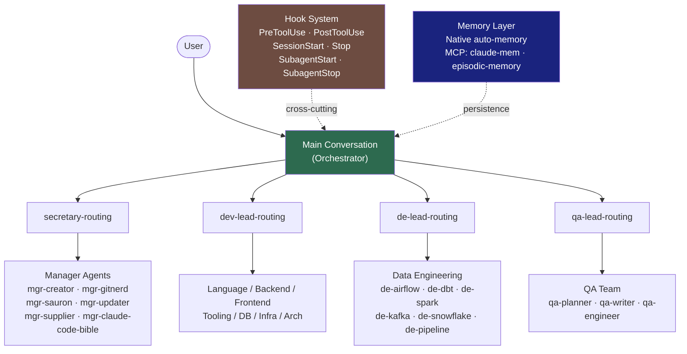
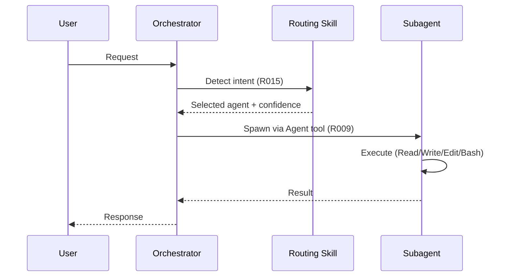
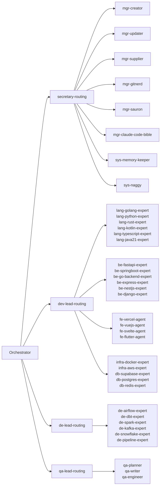
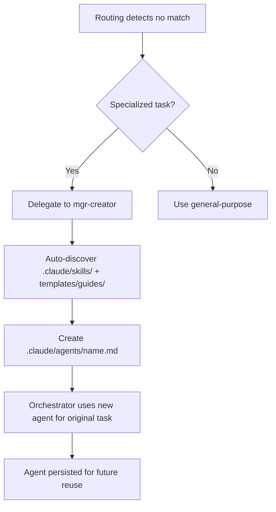
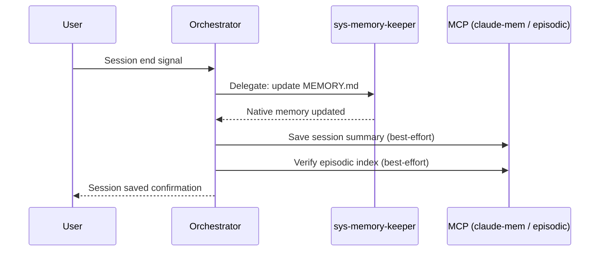
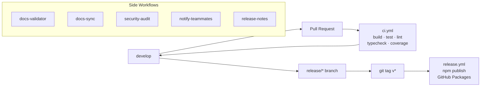

# Architecture

> oh-my-customcode v0.30.9

## 1. System Overview

oh-my-customcode is a batteries-included agent harness for Claude Code. It ships 44 pre-built subagents, 68 skills, 18 governing rules, and a hook system — all wired together so that any Claude Code session inherits a complete multi-agent operating model without additional configuration. The core philosophy is: **"No expert? CREATE one, connect knowledge, and USE it."** When a task arrives with no matching specialist, the system auto-creates one by discovering relevant skills and guides, then immediately executes the task.

Current version: **0.30.9** — distributed as `oh-my-customcode` on npm, CLI: `omcustom`.

---

## 2. High-Level Architecture



---

## 3. Component Inventory

### 3.1 Rule System (R000–R018, no R014)

| ID | Priority | Name | Description |
|----|----------|------|-------------|
| R000 | MUST | Language Policy | Korean I/O, English files, delegation model |
| R001 | MUST | Safety Rules | Prohibited actions, destructive-op gates |
| R002 | MUST | Permissions | Tool tier policy, file access scope |
| R003 | SHOULD | Interaction Rules | Response principles, status format |
| R004 | SHOULD | Error Handling | Error levels, recovery strategies |
| R005 | MAY | Optimization | Efficiency, token optimization |
| R006 | MUST | Agent Design | Agent file format, separation of concerns |
| R007 | MUST | Agent Identification | Every response starts with agent header |
| R008 | MUST | Tool Identification | Every tool call includes agent+model prefix |
| R009 | MUST | Parallel Execution | 2+ independent tasks MUST run in parallel |
| R010 | MUST | Orchestrator Coordination | Orchestrator never writes files directly |
| R011 | SHOULD | Memory Integration | Native auto-memory + MCP supplementary |
| R012 | SHOULD | HUD Statusline | Real-time session status display |
| R013 | SHOULD | Ecomode | Task-type-aware context budget thresholds |
| R015 | MUST | Intent Transparency | Display routing reasoning before execution |
| R016 | MUST | Continuous Improvement | Rule violation → update rule → continue |
| R017 | MUST | Sync Verification | 5+3 round verification before push |
| R018 | MUST (conditional) | Agent Teams | Mandatory when CLAUDE_CODE_EXPERIMENTAL_AGENT_TEAMS=1 |

### 3.2 Agent Taxonomy (44 agents)

| Category | Count | Agents |
|----------|-------|--------|
| SW Engineer / Language | 6 | lang-golang-expert, lang-python-expert, lang-rust-expert, lang-kotlin-expert, lang-typescript-expert, lang-java21-expert |
| SW Engineer / Backend | 6 | be-fastapi-expert, be-springboot-expert, be-go-backend-expert, be-express-expert, be-nestjs-expert, be-django-expert |
| SW Engineer / Frontend | 4 | fe-vercel-agent, fe-vuejs-agent, fe-svelte-agent, fe-flutter-agent |
| SW Engineer / Tooling | 3 | tool-npm-expert, tool-optimizer, tool-bun-expert |
| Data Engineering | 6 | de-airflow-expert, de-dbt-expert, de-spark-expert, de-kafka-expert, de-snowflake-expert, de-pipeline-expert |
| Database | 3 | db-supabase-expert, db-postgres-expert, db-redis-expert |
| Security | 1 | sec-codeql-expert |
| Architecture | 2 | arch-documenter, arch-speckit-agent |
| Infrastructure | 2 | infra-docker-expert, infra-aws-expert |
| QA | 3 | qa-planner, qa-writer, qa-engineer |
| Manager | 6 | mgr-creator, mgr-updater, mgr-supplier, mgr-gitnerd, mgr-sauron, mgr-claude-code-bible |
| System | 2 | sys-memory-keeper, sys-naggy |
| **Total** | **44** | |

### 3.3 Skill Catalog (68 skills)

**Routing skills (4, context: fork)**

| Skill | Routes To |
|-------|-----------|
| secretary-routing | mgr-* and sys-* agents |
| dev-lead-routing | lang-*, be-*, fe-*, tool-*, db-*, arch-*, infra-* agents |
| de-lead-routing | de-* agents |
| qa-lead-routing | qa-* agents |

**Workflow/orchestration skills (5, context: fork)**

dag-orchestration, task-decomposition, worker-reviewer-pipeline, pipeline-guards, structured-dev-cycle

**Best-practices skills (~25)**

go-best-practices, go-backend-best-practices, python-best-practices, rust-best-practices, kotlin-best-practices, typescript-best-practices, react-best-practices, web-design-guidelines, fastapi-best-practices, springboot-best-practices, django-best-practices, flutter-best-practices, docker-best-practices, aws-best-practices, postgres-best-practices, supabase-postgres-best-practices, redis-best-practices, kafka-best-practices, dbt-best-practices, spark-best-practices, snowflake-best-practices, airflow-best-practices, pipeline-architecture-patterns, vercel-deploy, writing-clearly-and-concisely

**Slash command / user-invocable skills**

analysis, create-agent, update-docs, update-external, audit-agents, fix-refs, dev-review, dev-refactor, memory-save, memory-recall, monitoring-setup, npm-publish, npm-version, npm-audit, codex-exec, optimize-analyze, optimize-bundle, optimize-report, research, sauron-watch, structured-dev-cycle, lists, status, help

**System / internal skills**

intent-detection, model-escalation, stuck-recovery, result-aggregation, multi-model-verification, pr-auto-improve, memory-management, claude-code-bible, cve-triage, jinja2-prompts, skills-sh-search

### 3.4 Guide Library (24 topics)

| Category | Guides |
|----------|--------|
| Internal | claude-code |
| Language | golang, python, rust, kotlin, typescript |
| Frontend | flutter, web-design |
| Backend | fastapi, springboot, go-backend, django-best-practices |
| Infrastructure | docker, aws |
| Data Engineering | airflow, dbt, kafka, spark, snowflake, iceberg |
| Database | supabase-postgres, postgres, redis |
| Writing | elements-of-style |

### 3.5 Hook System

| Event | Scripts / Handlers | Purpose |
|-------|--------------------|---------|
| SessionStart | session-env-check.sh | Detect codex CLI + Agent Teams availability |
| PreToolUse (Write/Edit) | stage-blocker.sh | Block writes outside implement stage |
| PreToolUse (Bash dev server) | inline script | Force dev servers into tmux |
| PreToolUse (Agent/Task) | HUD display, git-delegation-guard.sh, agent-teams-advisor.sh, model-escalation-advisor.sh | Spawn display, R010 enforcement, R018 advisory, escalation advisory |
| PostToolUse (Edit TS/JS) | prettier, tsc, console.log detector | Auto-format + type-check JS/TS |
| PostToolUse (Edit Go) | gofmt | Auto-format Go files |
| PostToolUse (Edit Py) | ruff, ty | Auto-format + type-check Python |
| PostToolUse (Bash) | PR URL logger | Log PR URL after `gh pr create` |
| PostToolUse (Agent/Task) | task-outcome-recorder.sh | Record outcomes for model escalation |
| PostToolUse (any tool) | context-budget-advisor.sh, stuck-detector.sh | Ecomode advisory, loop detection |
| SubagentStart | HUD inline display | Log agent type:model when subagent starts |
| SubagentStop | task-outcome-recorder.sh | Record final outcome |
| Stop | stop-console-audit.sh, session-compliance-report.sh, R011 prompt | Final audit, compliance report, memory checkpoint |

---

## 4. Orchestration Pattern

### 4.1 Singleton Orchestrator (R010)

The main conversation is the **sole orchestrator**. It coordinates via routing skills and the Agent tool. It NEVER writes or edits files directly — all file mutations are delegated to subagents.



### 4.2 Routing Architecture



### 4.3 Dynamic Agent Creation

When routing detects no matching specialist:



### 4.4 Intent Detection

Intent is scored before routing is executed (R015):

| Factor | Weight |
|--------|--------|
| Keywords | 40% |
| File patterns | 30% |
| Action verbs | 20% |
| Context (prior agent, cwd) | 10% |

| Confidence | Action |
|------------|--------|
| >= 90% | Auto-execute, display intent block |
| 70–89% | Request confirmation, show alternatives |
| < 70% | List options for user to choose |

---

## 5. Execution Patterns

### 5.1 Parallel Execution (R009)

Two or more independent tasks MUST run in parallel (max 4 concurrent). Sequential execution of parallelizable tasks is a rule violation.

```
Agent(task-1):sonnet   ┐
Agent(task-2):sonnet   ├─ Single message — all spawned together
Agent(task-3):haiku    │
Agent(task-4):haiku    ┘
```

Large tasks exceeding 3 minutes MUST be split into parallel sub-tasks. Before spawning 2+ agents, Agent Teams eligibility must be evaluated (see 5.2).

### 5.2 Agent Teams (R018, conditional)

Active when `CLAUDE_CODE_EXPERIMENTAL_AGENT_TEAMS=1`. When enabled and criteria are met, use is MANDATORY.

| Criteria | Agent Tool | Agent Teams (MUST) |
|----------|-----------|-------------------|
| 1–2 agents, independent | Yes | |
| 3+ agents | | Yes |
| Review → fix → re-review cycle | | Yes |
| Shared state / coordination needed | | Yes |
| Cost-sensitive batch ops | Yes | |

Lifecycle: `TeamCreate → TaskCreate → Agent(spawn all members in one message) → SendMessage → TaskUpdate → TeamDelete`

### 5.3 Research Pattern (/research)

10 research teams across 5 domains, executed in 3 batches per R009:

```
Batch 1: T1(Arch·breadth), T2(Arch·depth), T3(Sec·breadth), T4(Sec·depth)
Batch 2: T5(Intg·breadth), T6(Intg·depth), T7(Comp·breadth), T8(Comp·depth)
Batch 3: T9(Innov·breadth), T10(Innov·depth)

Phase 2: Cross-verification (2–5 rounds, opus + codex-exec)
Phase 3: Synthesis (opus) → ADOPT / ADAPT / AVOID taxonomy
Phase 4: Structured report + GitHub issue
```

---

## 6. Memory Architecture

### 6.1 Native Auto-Memory

Enabled by `memory:` field in agent frontmatter. The system creates a memory directory and injects the first 200 lines of `MEMORY.md` into the agent's system prompt.

| Scope | Location | Git Tracked |
|-------|----------|-------------|
| `user` | `~/.claude/agent-memory/<name>/` | No |
| `project` | `.claude/agent-memory/<name>/` | Yes |
| `local` | `.claude/agent-memory-local/<name>/` | No |

Memory entries carry confidence annotations (`[confidence: low/medium/high]`). New discoveries start at `low`; user confirmation or cross-session verification promotes them.

### 6.2 MCP Memory (Supplementary)

MCP tools are orchestrator-scoped — subagents cannot access them.

| System | Tool | Use Case |
|--------|------|----------|
| claude-mem | `mcp__plugin_claude-mem_mcp-search__save_memory` | Cross-session search, temporal queries |
| episodic-memory | `mcp__plugin_episodic-memory_episodic-memory__search` | Session indexing for future retrieval |

Use native auto-memory first. Fall back to MCP only for cross-session search or temporal queries.

### 6.3 Session-End Flow



MCP saves are non-blocking — failure does not prevent session end.

---

## 7. CI/CD Pipeline



### 7.1 Quality Gates

| Gate | Tool / Script | Threshold |
|------|---------------|-----------|
| Code coverage | bun test --coverage | 97% |
| Version sync | manifest.json ↔ package.json | Exact match |
| Docs validation | validate-docs.ts | README count consistency |
| Sauron verification | mgr-sauron (R017) | All 5+3 rounds pass |
| TypeScript | tsc --noEmit | Zero errors |
| Lint | biome check | Zero errors |

---

## 8. Distribution Model

### 8.1 npm Package

```
Package: oh-my-customcode
CLI:     omcustom
Registry: registry.npmjs.org (public)

Exports:
  dist/         — compiled CLI + library
  templates/    — .claude/ directory structure for target projects
```

Runtime deps: commander, i18next, yaml. Build/runtime: bun. Node >=18 required.

npm publish is triggered only by the CI/CD pipeline on `release/*` branches — never run locally.

### 8.2 Template System

`templates/` mirrors `.claude/` so that `omcustom` can scaffold agent systems into any project. `manifest.json` declares counts of agents, skills, hooks, contexts, and guides; CI enforces these counts match the filesystem.

---

## 9. Claude Code Compatibility

| Feature | < v2.1.63 | >= v2.1.63 | oh-my-customcode |
|---------|-----------|-----------|------------------|
| Subagent tool name | Task | Agent | Dual support (Agent/Task) |
| subagent_type field | Yes | Yes (unchanged) | Yes |
| Hook matcher | `tool == "Task"` | `tool == "Agent"` | `tool == "Task" \|\| tool == "Agent"` |
| SubagentStart event | No | Yes | Yes (v0.23.0+) |
| SubagentStop event | No | Yes | Yes (v0.23.0+) |
| Agent Teams | No | Yes (experimental) | Yes, enforced by R018 when enabled |

---

## 10. Context Budget

| Item | Approximate Size |
|------|-----------------|
| CLAUDE.md | ~5K tokens |
| Rules (18 files) | ~25K tokens |
| Total mandatory load | ~30K tokens / session |

Skills and guides are loaded on-demand when invoked — not pre-loaded.

**Ecomode (R013)** auto-activates based on task type and context usage:

| Task Type | Context Trigger |
|-----------|----------------|
| Research (/research, 10-team) | 40% |
| Implementation (code generation) | 50% |
| Review (code review, audit) | 60% |
| Management (git, deploy, CI) | 70% |
| General (default) | 80% |

The `context-budget-advisor.sh` PostToolUse hook monitors usage and emits advisory warnings as thresholds are approached.

---

## 11. Glossary

| Term | Definition |
|------|-----------|
| Orchestrator | The main Claude Code conversation; the sole coordinator. Never writes files. |
| Subagent | An isolated agent instance spawned by the orchestrator via the Agent tool. |
| Routing skill | A `context: fork` skill that maps user intent to the correct specialist agent. |
| Agent Teams | Claude Code experimental feature (R018) enabling peer-to-peer agent messaging via TeamCreate/SendMessage. |
| Hook | A script bound to a Claude Code lifecycle event (PreToolUse, PostToolUse, etc.) in hooks.json. |
| Native auto-memory | The `memory:` frontmatter field that injects MEMORY.md into an agent's context each session. |
| Dynamic creation | The fallback pattern where mgr-creator auto-builds a new specialist when no existing agent matches. |
| Ecomode | Compact output mode that activates automatically when context usage exceeds task-type thresholds. |
| context: fork | A SKILL.md frontmatter flag that runs the skill in an isolated context — used for routing and orchestration skills. |
| R017 (Sauron) | The 5-round manager + 3-round deep-review verification cycle required before any structural push. |
