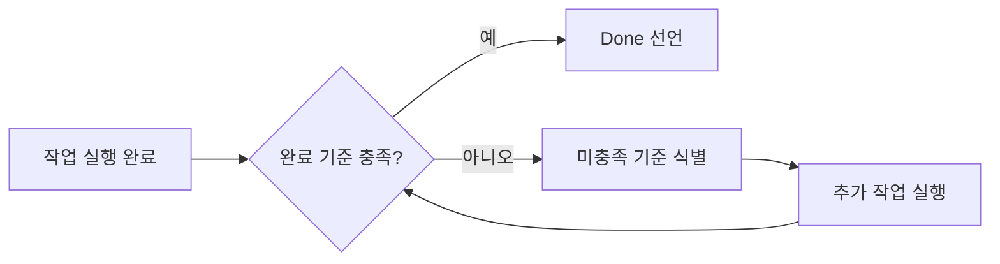

# 아키텍처

> oh-my-customcode v0.42.0

## 1. 시스템 개요

oh-my-customcode는 Claude Code를 위한 배터리 포함형 에이전트 하네스입니다. 44개의 사전 구축된 서브에이전트, 74개의 스킬, 21개의 거버넌스 규칙, 훅 시스템이 모두 연결되어 있어 추가 설정 없이 Claude Code 세션에 완전한 멀티 에이전트 운영 모델이 적용됩니다. 핵심 철학: **"전문가가 없으면? 만들고, 지식을 연결하고, 사용한다."** 매칭되는 전문가가 없는 작업이 들어오면 시스템이 자동으로 관련 스킬과 가이드를 탐색하여 새 에이전트를 생성한 뒤 즉시 작업을 실행합니다.

현재 버전: **0.38.0** -- npm 패키지명 `oh-my-customcode`, CLI: `omcustom`

### 1.1 컴파일레이션 메타포

oh-my-customcode는 에이전트 시스템을 "소스 코드"로, 실행 중인 Claude Code 세션을 "컴파일된 런타임"으로 취급합니다. 규칙, 스킬, 에이전트 정의가 하네스 사양(spec)을 구성하고, `omcustom` CLI가 이를 대상 프로젝트의 `.claude/` 디렉토리로 컴파일합니다. 이 메타포는 세 가지 핵심 이점을 제공합니다:

1. **사양 밀도 (Spec Density)**: 각 규칙과 스킬은 에이전트 행동을 최대 정밀도로 제어하는 압축된 사양 단위입니다.
2. **Takeover (역컴파일)**: 기존 프로젝트의 `.claude/` 구성을 분석하여 oh-my-customcode 사양으로 역컴파일하는 패턴입니다 (`/omcustom-takeover`).
3. **결정론적 재현**: 동일한 사양 입력은 동일한 에이전트 행동을 재현합니다 -- 프로젝트 간, 세션 간 일관성을 보장합니다.

<p align="center">
  
</p>

---

## 2. 고수준 아키텍처

<p align="center">
  
</p>

---

## 3. 컴포넌트 인벤토리

### 3.1 규칙 시스템 (R000--R021, R014 없음)

| ID | 우선순위 | 이름 | 설명 |
|----|----------|------|------|
| R000 | MUST | 언어 정책 | 한국어 I/O, 영어 파일, 위임 모델 |
| R001 | MUST | 안전 규칙 | 금지 행위, 파괴적 작업 승인 게이트 |
| R002 | MUST | 권한 규칙 | 도구 티어 정책, 파일 접근 범위 |
| R003 | SHOULD | 상호작용 규칙 | 응답 원칙, 상태 포맷 |
| R004 | SHOULD | 오류 처리 | 오류 등급, 복구 전략 |
| R005 | MAY | 최적화 | 효율성, 토큰 최적화 |
| R006 | MUST | 에이전트 설계 | 에이전트 파일 포맷, 관심사 분리 |
| R007 | MUST | 에이전트 식별 | 모든 응답은 에이전트 헤더로 시작 |
| R008 | MUST | 도구 식별 | 모든 도구 호출에 에이전트+모델 접두사 포함 |
| R009 | MUST | 병렬 실행 | 독립 작업 2개 이상은 반드시 병렬 실행 |
| R010 | MUST | 오케스트레이터 조율 | 오케스트레이터는 절대 파일을 직접 작성하지 않음 |
| R011 | SHOULD | 메모리 통합 | 네이티브 자동 메모리 + MCP 보조 |
| R012 | SHOULD | HUD 상태줄 | 실시간 세션 상태 표시 |
| R013 | SHOULD | Ecomode | 작업 유형별 컨텍스트 예산 임계값 |
| R015 | MUST | 의도 투명성 | 라우팅 실행 전 reasoning 표시 |
| R016 | MUST | 지속적 개선 | 규칙 위반 시 -> 규칙 업데이트 -> 계속 |
| R017 | MUST | 동기화 검증 | 푸시 전 5+3 라운드 검증 |
| R018 | MUST (조건부) | Agent Teams | CLAUDE_CODE_EXPERIMENTAL_AGENT_TEAMS=1 시 필수 |
| R019 | SHOULD | Ontology-RAG 라우팅 | 라우팅 스킬의 ontology-RAG enrichment |
| R020 | MUST | 완료 검증 | 작업 완료 선언 전 task-type-specific 검증 |
| R021 | MUST | Enforcement Policy | Advisory-first 시행 모델, 강화 승격 기준 |

### 3.2 에이전트 분류 (44개)

| 카테고리 | 수량 | 에이전트 |
|----------|------|----------|
| SW Engineer / 언어 | 6 | lang-golang-expert, lang-python-expert, lang-rust-expert, lang-kotlin-expert, lang-typescript-expert, lang-java21-expert |
| SW Engineer / 백엔드 | 6 | be-fastapi-expert, be-springboot-expert, be-go-backend-expert, be-express-expert, be-nestjs-expert, be-django-expert |
| SW Engineer / 프론트엔드 | 4 | fe-vercel-agent, fe-vuejs-agent, fe-svelte-agent, fe-flutter-agent |
| SW Engineer / 툴링 | 3 | tool-npm-expert, tool-optimizer, tool-bun-expert |
| 데이터 엔지니어링 | 6 | de-airflow-expert, de-dbt-expert, de-spark-expert, de-kafka-expert, de-snowflake-expert, de-pipeline-expert |
| 데이터베이스 | 3 | db-supabase-expert, db-postgres-expert, db-redis-expert |
| 보안 | 1 | sec-codeql-expert |
| 아키텍처 | 2 | arch-documenter, arch-speckit-agent |
| 인프라 | 2 | infra-docker-expert, infra-aws-expert |
| QA | 3 | qa-planner, qa-writer, qa-engineer |
| 매니저 | 6 | mgr-creator, mgr-updater, mgr-supplier, mgr-gitnerd, mgr-sauron, mgr-claude-code-bible |
| 시스템 | 2 | sys-memory-keeper, sys-naggy |
| **합계** | **44** | |

### 3.3 스킬 카탈로그 (74개)

**라우팅 스킬 (4개, context: fork)**

| 스킬 | 라우팅 대상 |
|------|------------|
| secretary-routing | mgr-* 및 sys-* 에이전트 |
| dev-lead-routing | lang-*, be-*, fe-*, tool-*, db-*, arch-*, infra-* 에이전트 |
| de-lead-routing | de-* 에이전트 |
| qa-lead-routing | qa-* 에이전트 |

**워크플로우/오케스트레이션 스킬 (7개, context: fork)**

dag-orchestration, task-decomposition, worker-reviewer-pipeline, pipeline-guards, sauron-watch, deep-plan, evaluator-optimizer

**베스트 프랙티스 스킬 (~26개)**

go-best-practices, go-backend-best-practices, python-best-practices, rust-best-practices, kotlin-best-practices, typescript-best-practices, java21-best-practices, react-best-practices, web-design-guidelines, fastapi-best-practices, springboot-best-practices, django-best-practices, flutter-best-practices, docker-best-practices, aws-best-practices, postgres-best-practices, supabase-postgres-best-practices, redis-best-practices, kafka-best-practices, dbt-best-practices, spark-best-practices, snowflake-best-practices, airflow-best-practices, pipeline-architecture-patterns, vercel-deploy, writing-clearly-and-concisely

**슬래시 커맨드 / 사용자 직접 호출 스킬**

analysis, create-agent, update-docs, update-external, audit-agents, fix-refs, dev-review, dev-refactor, memory-save, memory-recall, monitoring-setup, npm-publish, npm-version, npm-audit, codex-exec, optimize-analyze, optimize-bundle, optimize-report, research, deep-plan, sauron-watch, structured-dev-cycle, omcustom-takeover, omcustom-release-notes, lists, status, help

**시스템 / 내부 스킬**

intent-detection, model-escalation, stuck-recovery, result-aggregation, multi-model-verification, pr-auto-improve, memory-management, claude-code-bible, cve-triage, jinja2-prompts, skills-sh-search, reasoning-sandwich, evaluator-optimizer

### 3.4 가이드 라이브러리 (25개 토픽)

| 카테고리 | 가이드 |
|----------|--------|
| 내부 | claude-code |
| 언어 | golang, python, rust, kotlin, typescript, java21 |
| 프론트엔드 | flutter, web-design |
| 백엔드 | fastapi, springboot, go-backend, django-best-practices |
| 인프라 | docker, aws |
| 데이터 엔지니어링 | airflow, dbt, kafka, spark, snowflake, iceberg |
| 데이터베이스 | supabase-postgres, postgres, redis |
| 글쓰기 | elements-of-style |

### 3.5 훅 시스템

| 이벤트 | 스크립트 / 핸들러 | 목적 |
|--------|------------------|------|
| SessionStart | session-env-check.sh | codex CLI + Agent Teams 가용성 감지 |
| PreToolUse (Write/Edit) | stage-blocker.sh, secret-filter.sh | implement 단계 외 쓰기 차단, 시크릿 유출 방지 |
| PreToolUse (Bash dev server) | 인라인 스크립트 | dev 서버를 tmux로 강제 |
| PreToolUse (Agent/Task) | HUD 표시, git-delegation-guard.sh, agent-teams-advisor.sh, model-escalation-advisor.sh | 스폰 표시, R010 강제, R018 어드바이저리, 에스컬레이션 어드바이저리 |
| PostToolUse (Edit TS/JS) | prettier, tsc, console.log 탐지 | JS/TS 자동 포맷 + 타입 체크 |
| PostToolUse (Edit Go) | gofmt | Go 파일 자동 포맷 |
| PostToolUse (Edit Py) | ruff, ty | Python 자동 포맷 + 타입 체크 |
| PostToolUse (Bash) | PR URL 로거 | `gh pr create` 후 PR URL 기록 |
| PostToolUse (Agent/Task) | task-outcome-recorder.sh | 모델 에스컬레이션 결과 기록 |
| PostToolUse (모든 도구) | context-budget-advisor.sh, stuck-detector.sh, audit-log.sh | Ecomode 어드바이저리, 반복 루프 감지, 감사 로그 기록 |
| PostToolUse (Write/Edit) | schema-validator.sh, content-hash-validator.sh | 구조 검증, 콘텐츠 해시 검증 |
| PostCompact | compact-rules-reinforcement (인라인) | 컨텍스트 압축 후 R007/R008/R009/R010/R018 규칙 재주입 |
| SubagentStart | HUD 인라인 표시 | 서브에이전트 시작 시 agent type:model 로그 |
| SubagentStop | task-outcome-recorder.sh | 최종 결과 기록 |
| Stop | stop-console-audit.sh, eval-core-batch-save.sh, R011 프롬프트 | 최종 감사, 배치 평가 저장, 메모리 체크포인트 |

---

## 4. 오케스트레이션 패턴

### 4.1 싱글톤 오케스트레이터 (R010)

메인 대화가 **유일한 오케스트레이터**입니다. 라우팅 스킬과 Agent 도구를 통해 조율하며, **절대 직접 파일을 작성하거나 편집하지 않습니다** -- 모든 파일 변경은 서브에이전트에 위임됩니다.

<p align="center">
  
</p>

### 4.2 라우팅 아키텍처

<p align="center">
  
</p>

### 4.3 동적 에이전트 생성

라우팅에서 매칭되는 전문가를 찾지 못할 경우:

<p align="center">
  
</p>

### 4.4 의도 감지

라우팅 실행 전 의도 점수가 산출됩니다 (R015):

| 요소 | 가중치 |
|------|--------|
| 키워드 | 40% |
| 파일 패턴 | 30% |
| 동작 동사 | 20% |
| 컨텍스트 (이전 에이전트, 작업 디렉토리) | 10% |

| 신뢰도 | 동작 |
|--------|------|
| >= 90% | 자동 실행, 의도 블록 표시 |
| 70--89% | 확인 요청, 대안 표시 |
| < 70% | 사용자가 선택할 수 있는 옵션 목록 표시 |

### 4.5 Ontology-RAG Enrichment (R019)

라우팅 스킬이 에이전트를 선택한 후, `get_agent_for_task` MCP 도구를 호출하여 `suggested_skills`를 추출합니다. 이 스킬 힌트가 스폰되는 에이전트의 프롬프트에 주입되어 컨텍스트 풍부한 실행을 가능하게 합니다. MCP 장애 시 무음 스킵 -- 라우팅을 차단하지 않습니다.

---

## 5. 실행 패턴

### 5.1 병렬 실행 (R009)

독립적인 작업이 2개 이상이면 반드시 병렬 실행합니다 (최대 4개 동시). 병렬 가능한 작업을 순차 실행하는 것은 규칙 위반입니다.

```
Agent(task-1):sonnet   ┐
Agent(task-2):sonnet   ├─ 단일 메시지 -- 모두 동시에 스폰
Agent(task-3):haiku    │
Agent(task-4):haiku    ┘
```

3분을 초과하는 대형 작업은 반드시 병렬 서브 태스크로 분할합니다. 에이전트 2개 이상 스폰 전에 Agent Teams 적격성을 평가해야 합니다 (5.2 참조).

### 5.2 Agent Teams (R018, 조건부)

`CLAUDE_CODE_EXPERIMENTAL_AGENT_TEAMS=1` 설정 시 활성화됩니다. 활성화 상태에서 기준을 충족하면 사용이 **의무**입니다.

| 기준 | Agent 도구 | Agent Teams (MUST) |
|------|-----------|-------------------|
| 1--2개 에이전트, 독립적 | 예 | |
| 3개 이상 에이전트 | | 예 |
| 리뷰 -> 수정 -> 재리뷰 사이클 | | 예 |
| 공유 상태 / 에이전트 간 조율 필요 | | 예 |
| 비용 민감 배치 작업 | 예 | |

Agent Teams 멤버는 서브에이전트를 스폰할 수 있습니다 (R010 예외) -- Teams 호환 스킬(`/research`, `/deep-plan`)이 Teams 멤버 내부에서 실행 가능합니다.

라이프사이클: `TeamCreate -> TaskCreate -> Agent(모든 멤버를 한 메시지에 스폰) -> SendMessage -> TaskUpdate -> TeamDelete`

### 5.3 리서치 패턴 (/research)

5개 도메인에 걸친 10개 리서치 팀, R009에 따라 3개 배치로 실행:

```
배치 1: T1(아키텍처 광역), T2(아키텍처 심층), T3(보안 광역), T4(보안 심층)
배치 2: T5(통합 광역), T6(통합 심층), T7(비교 광역), T8(비교 심층)
배치 3: T9(혁신 광역), T10(혁신 심층)

Phase 2: 교차 검증 (2--5 라운드, opus + codex-exec)
Phase 3: 종합 (opus) -> ADOPT / ADAPT / AVOID 분류
Phase 4: 구조화된 리포트 + GitHub 이슈 생성
```

### 5.4 완료 검증 (R020)

모든 작업은 `[Done]` 선언 전에 task-type-specific 완료 기준을 충족해야 합니다. 거짓 완료 선언은 다운스트림 장애를 유발하며 신뢰를 훼손합니다.



### 5.5 Evaluator-Optimizer 패턴

반복적 품질 개선이 필요한 작업에 evaluator-optimizer 패턴을 적용합니다. 구현 에이전트가 초안을 생성하고, 평가 에이전트가 품질을 측정한 뒤, 기준 미달 시 구현 에이전트에 피드백을 반환하는 루프입니다.

---

## 6. 메모리 아키텍처

### 6.1 네이티브 자동 메모리

에이전트 프론트매터의 `memory:` 필드로 활성화됩니다. 시스템이 메모리 디렉토리를 생성하고 `MEMORY.md`의 앞 200줄을 에이전트 시스템 프롬프트에 주입합니다.

| 스코프 | 위치 | Git 추적 |
|--------|------|----------|
| `user` | `~/.claude/agent-memory/<name>/` | 아니오 |
| `project` | `.claude/agent-memory/<name>/` | 예 |
| `local` | `.claude/agent-memory-local/<name>/` | 아니오 |

메모리 항목에는 신뢰도 어노테이션(`[confidence: low/medium/high]`)이 포함됩니다. 새로운 발견은 `low`에서 시작하며, 사용자 확인 또는 교차 세션 검증 시 승급됩니다.

### 6.2 시간 감쇠 (Temporal Decay)

메모리 항목은 시간이 지남에 따라 관련성이 감소합니다. 신뢰도 수명 주기는 다음과 같습니다:

```
[low] -> 재관찰 시 -> [medium] -> 사용자 확인/테스트 통과 시 -> [high]
[any] -> 증거에 의해 반박 시 -> 강등 또는 제거
```

MEMORY.md 200줄 예산에 근접하면 다음 순서로 정리합니다:
1. `[confidence: low]` 항목 우선 정리
2. `[confidence: medium]` 항목 정리
3. `[confidence: high]` 항목은 자동 정리하지 않음

오래된 `[confidence: low]` 항목은 2개 세션 이상 재관찰되지 않으면 자동 정리 대상입니다.

### 6.3 행동 메모리 (Behavioral Memory)

MEMORY.md는 선택적 `## Behaviors` 섹션을 지원하여 사용자 상호작용 선호도와 워크플로우 패턴을 추적합니다. 행동 관찰은 SOUL.md 기본값보다 우선합니다 (R006).

### 6.4 MCP 메모리 (보조)

MCP 도구는 오케스트레이터 스코프이며, 서브에이전트는 접근할 수 없습니다.

| 시스템 | 도구 | 사용 사례 |
|--------|------|-----------|
| claude-mem | `mcp__plugin_claude-mem_mcp-search__save_memory` | 교차 세션 검색, 시간 기반 쿼리 |

네이티브 자동 메모리를 우선 사용하고, 교차 세션 검색 또는 시간 기반 쿼리가 필요한 경우에만 MCP를 사용합니다.

### 6.5 세션 종료 흐름

<p align="center">
  
</p>

MCP 저장은 논블로킹 -- 실패해도 세션 종료를 막지 않습니다. episodic-memory는 세션 종료 후 자동으로 대화를 인덱싱하므로 수동 저장이나 검증 단계가 필요하지 않습니다.

---

## 7. 관측성 (Observability)

### 7.1 에이전트 메트릭

`task-outcome-recorder.sh` 훅이 모든 서브에이전트 실행의 성공/실패를 기록합니다. 이 데이터는 model-escalation 어드바이저리 시스템에 피드백됩니다.

| 메트릭 | 기록 위치 | 용도 |
|--------|----------|------|
| 에이전트별 성공/실패 횟수 | `/tmp/.claude-escalation-*` | 모델 에스컬레이션 임계값 판단 |
| 비용 누적량 | statusline API | 비용 모니터링 + cost-cap 게이트 |
| 컨텍스트 사용량 | statusline API | Ecomode 트리거 |

### 7.2 스킬 효과성 추적

에이전트 프론트매터에 `escalation.enabled: true`를 설정하면 해당 에이전트 타입의 성공률이 추적됩니다. 실패 횟수가 `threshold`를 초과하면 에스컬레이션 어드바이저리가 발행됩니다.

```
haiku -> sonnet -> opus (에스컬레이션 경로)
```

<p align="center">
  
</p>

### 7.3 감사 로그

`audit-log.sh` 훅이 모든 도구 호출을 세션별 감사 로그에 기록합니다. `secret-filter.sh`는 Write/Edit 작업에서 시크릿 패턴을 탐지하여 유출을 방지합니다.

---

## 8. CI/CD 파이프라인

<p align="center">
  
</p>

### 8.1 품질 게이트

| 게이트 | 도구 / 스크립트 | 임계값 |
|--------|----------------|--------|
| 코드 커버리지 | bun test --coverage | 97% |
| 버전 동기화 | manifest.json <-> package.json | 정확히 일치 |
| 문서 검증 | validate-docs.ts | README 카운트 일관성 |
| Sauron 검증 | mgr-sauron (R017) | 5+3 라운드 모두 통과 |
| TypeScript | tsc --noEmit | 오류 없음 |
| 린트 | biome check | 오류 없음 |

---

## 9. 배포 모델

### 9.1 npm 패키지

```
패키지: oh-my-customcode
CLI:    omcustom
레지스트리: registry.npmjs.org (public)

배포 파일:
  dist/         -- 컴파일된 CLI + 라이브러리
  templates/    -- 대상 프로젝트용 .claude/ 디렉토리 구조
```

런타임 의존성: commander, i18next, yaml. 빌드/런타임: bun. Node >= 18 필요.

npm 배포는 CI/CD 파이프라인의 `release/*` 브랜치에서만 트리거되며, 로컬에서 직접 실행하지 않습니다.

### 9.2 템플릿 시스템

`templates/`는 `omcustom`이 모든 프로젝트에 에이전트 시스템을 스캐폴딩할 수 있도록 `.claude/`를 미러링합니다. `manifest.json`은 에이전트, 스킬, 훅, 컨텍스트, 가이드의 카운트를 선언하며, CI가 이 카운트가 파일시스템과 일치하는지 강제합니다.

### 9.3 패키지

`packages/eval-core/`는 v0.38.0에서 추가된 독립형 SQLite 기반 평가 패키지입니다. 메인 하네스 런타임 외부에서 에이전트 성능을 측정하기 위한 세션/턴/결과 수집 기능을 제공합니다.

```
packages/eval-core/
  src/db/       — SQLite 스키마 + 마이그레이션
  src/collect/  — 세션, 턴, 결과 수집기
  src/query/    — 집계 및 리포팅 쿼리
```

### 9.4 Init 위자드

`src/cli/wizard.ts`의 대화형 설정 플로우는 첫 사용자가 프로젝트를 초기화할 수 있도록 안내합니다: 대상 언어/프레임워크 선택, 관련 에이전트 및 스킬 설치, `.claude/` 설정 작성. `omcustom init`으로 실행합니다.

---

## 10. 컨텍스트 예산

| 항목 | 대략적 크기 |
|------|------------|
| CLAUDE.md | ~5K 토큰 |
| 규칙 (21개 파일) | ~28K 토큰 |
| 세션당 필수 로드 합계 | ~33K 토큰 |

스킬과 가이드는 호출될 때만 온디맨드로 로드됩니다 -- 사전 로드하지 않습니다.

**Ecomode (R013)** 는 작업 유형과 컨텍스트 사용량에 따라 자동으로 활성화됩니다:

| 작업 유형 | 컨텍스트 트리거 |
|-----------|----------------|
| 리서치 (/research, 10팀) | 40% |
| 구현 (코드 생성) | 50% |
| 리뷰 (코드 리뷰, 감사) | 60% |
| 관리 (git, 배포, CI) | 70% |
| 일반 (기본값) | 80% |

`context-budget-advisor.sh` PostToolUse 훅이 사용량을 모니터링하고 임계값에 근접하면 어드바이저리 경고를 출력합니다.

---

## 11. Claude Code 호환성

| 기능 | < v2.1.63 | >= v2.1.63 | oh-my-customcode |
|------|-----------|-----------|------------------|
| 서브에이전트 도구명 | Task | Agent | 듀얼 지원 (Agent/Task) |
| subagent_type 필드 | 예 | 예 (변경 없음) | 예 |
| 훅 매처 | `tool == "Task"` | `tool == "Agent"` | `tool == "Task" \|\| tool == "Agent"` |
| SubagentStart 이벤트 | 아니오 | 예 | 예 (v0.23.0+) |
| SubagentStop 이벤트 | 아니오 | 예 | 예 (v0.23.0+) |
| Agent Teams | 아니오 | 예 (실험적) | 예, R018 활성화 시 강제 |
| Agent isolation/background | 아니오 | 예 | 예 (프론트매터: isolation, background) |
| Agent maxTurns | 아니오 | 예 | 예 (프론트매터: maxTurns) |
| Agent hooks | 아니오 | 예 | 예 (프론트매터: hooks) |
| Agent permissionMode | 아니오 | 예 | 예 (프론트매터: permissionMode) |
| PostCompact 훅 이벤트 | 아니오 | 예 (v2.1.72+) | 예 (v0.38.0+) -- 압축 후 규칙 재주입 |
| 스킬 effort 프론트매터 | 아니오 | 예 (v2.1.80+) | 예 (R006 문서화) |
| 상태줄 rate_limits | 아니오 | 예 (v2.1.80+) | 예 (statusline.sh, R012) |
| source: 'settings' 플러그인 | 아니오 | 예 (v2.1.80+) | 미채택 |
| --bare 플래그 (훅/스킬/메모리 스킵) | 아니오 | 예 (v2.1.81+) | 문서화됨: bare 모드에서 하네스 완전 비활성화 (opt-in, 일반 사용에 영향 없음) |
| --channels 권한 릴레이 | 아니오 | 예 (v2.1.81+) | 호환 -- 변경 불필요 (opt-in UX 기능) |

Claude Code v2.1.72 ~ v2.1.81 테스트 및 호환 확인.

---

## 12. 용어 정의

| 용어 | 정의 |
|------|------|
| 오케스트레이터 (Orchestrator) | 메인 Claude Code 대화; 유일한 조율자. 파일을 직접 작성하지 않음. |
| 서브에이전트 (Subagent) | 오케스트레이터가 Agent 도구를 통해 스폰하는 격리된 에이전트 인스턴스. |
| 라우팅 스킬 (Routing Skill) | 사용자 의도를 올바른 전문가 에이전트로 매핑하는 `context: fork` 스킬. |
| Agent Teams | 피어 투 피어 에이전트 메시징을 가능하게 하는 Claude Code 실험적 기능 (R018). TeamCreate/SendMessage 활용. |
| 훅 (Hook) | hooks.json에서 Claude Code 라이프사이클 이벤트에 바인딩된 스크립트 (PreToolUse, PostToolUse 등). |
| 네이티브 자동 메모리 | 에이전트 프론트매터의 `memory:` 필드로 MEMORY.md를 매 세션 컨텍스트에 주입하는 기능. |
| 동적 생성 (Dynamic Creation) | 매칭되는 에이전트가 없을 때 mgr-creator가 자동으로 새 전문가를 생성하는 폴백 패턴. |
| Ecomode | 컨텍스트 사용량이 작업 유형별 임계값을 초과할 때 자동 활성화되는 압축 출력 모드. |
| context: fork | 라우팅 및 오케스트레이션 스킬에 사용되는 격리된 컨텍스트로 스킬을 실행하는 SKILL.md 프론트매터 플래그. |
| R017 (Sauron) | 구조적 변경 사항을 푸시하기 전에 필요한 5라운드 매니저 + 3라운드 심층 리뷰 검증 사이클. |
| R020 (완료 검증) | 작업 완료 선언 전 task-type-specific 기준을 검증하는 규칙. 거짓 완료 방지. |
| 컴파일레이션 메타포 | 에이전트 사양을 소스 코드로, 실행 세션을 컴파일된 런타임으로 취급하는 설계 철학. |
| Takeover | 기존 프로젝트의 `.claude/` 구성을 oh-my-customcode 사양으로 역컴파일하는 패턴. |
| Evaluator-Optimizer | 구현-평가-피드백 루프를 통한 반복적 품질 개선 패턴. |
| 시간 감쇠 (Temporal Decay) | 메모리 항목의 관련성이 시간 경과에 따라 감소하는 수명 주기 모델. |
| PostCompact 훅 | 컨텍스트 압축 후 발생하는 Claude Code 라이프사이클 이벤트 (v2.1.72+); 핵심 규칙 재주입에 사용. |
| eval-core | `packages/eval-core/` 독립형 패키지. SQLite 기반 세션/턴/결과 수집으로 오프라인 평가를 지원. |
| Init 위자드 | 새 프로젝트에 `.claude/`를 구성하는 대화형 최초 설정 플로우 (`omcustom init`). |

---

## 13. 버전 히스토리

| 버전 | 주요 변경 사항 |
|------|--------------|
| v0.38.0 | PostCompact 훅 (컨텍스트 압축 후 R007/R008/R009/R010/R018 규칙 재주입); eval-core 패키지 (`packages/eval-core/` SQLite 세션/턴/결과 수집); init 위자드 (`src/cli/wizard.ts`); context:fork 캡 10→12 상향 (11개 활성); 훅 시스템 정리 (고아 제거, 중복 수정, 필드명 정정); 템플릿 완전 동기화 (200개+ 파일 바이트 단위 동일); Claude Code v2.1.72–v2.1.76 호환성 |
| v0.37.3 | 버전 범프 + 패치 수정 |
| v0.37.0 | 구조 최적화: 규칙 압축, 스킬 압축, 에이전트-스킬 와이어링, 훅 최적화, 라우팅 압축, 도메인 게이팅 (6개 이슈, #386–#392) |
| v0.36.1 | /omcustom-release-notes 스킬; README/ARCHITECTURE 전면 재작성 ("Compiled, Not Configured" 철학); 템플릿 스킬 동기화 수정 |
| v0.36.0 | Harness Engineering (26개 이슈): R020 완료 검증, 보안 훅 (audit-log, secret-filter, schema-validator, content-hash-validator), 도구 축소 (에이전트 10개, 도구 26개 제거), 프론트매터 확장 (isolation/sandbox, maxTokens, limitations), reasoning-sandwich, omcustom-takeover, sauron 구조 린팅, 메모리 시간 감쇠, 에이전트 메트릭, 스킬 효과성 |
| v0.35.x | 비용 모니터링, pre-flight 가드, Agent Teams 호환성 (R010 Teams 예외), episodic-memory 세션 종료 수정 |
| v0.34.0 | Evaluator-optimizer, 워크플로우 패턴, stuck-detector 하드 블록, pre-flight 가드 |
| v0.32.0–v0.33.x | deep-plan 스킬, validate-docs 훅 카운팅 수정 |
| v0.31.0 | SOUL.md 에이전트별 정체성, 행동 메모리, 아티팩트 출력 |
| v0.30.0 | 드리프트 감지, 컨텍스트 예산, 신뢰도 추적 메모리, structured-dev-cycle |
