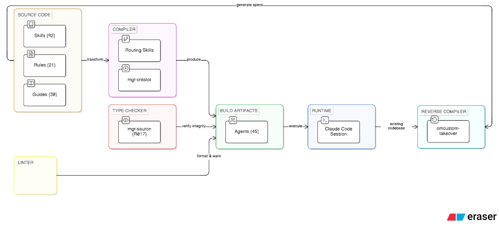
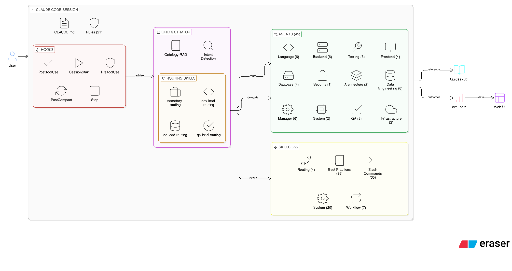

<div align="center">
  
</div>

# oh-my-customcode

> **AI 에이전트 스택. 설정이 아닌 컴파일.**

[](https://www.npmjs.com/package/oh-my-customcode)
[](https://polyformproject.org/licenses/noncommercial/1.0.0/)
[](https://github.com/baekenough/oh-my-customcode/actions/workflows/ci.yml)
[](https://github.com/baekenough/oh-my-customcode/actions/workflows/security-audit.yml)

**[English Documentation](./README.md)**

50개 에이전트. 115개 스킬. 23개 규칙. 명령어 하나.

```bash
npm install -g oh-my-customcode && cd your-project && omcustom init
```

---

## 철학

oh-my-customcode는 두 가지 아이디어 위에 세워졌습니다.

**1. 에이전트 시스템은 설정하는 게 아니라 컴파일한다.**

| 컴파일 개념 | oh-my-customcode |
|------------|-----------------|
| 소스코드 | `.claude/skills/` — 재사용 가능한 지식과 워크플로우 |
| 빌드 결과물 | `.claude/agents/` — 스킬을 조합한 실행 가능한 전문가 |
| 컴파일러 | `mgr-sauron` (R017) — 구조 검증과 정합성 보장 |
| 스펙 | `.claude/rules/` — 제약 조건과 빌드 규칙 |
| 링커 | Routing skills — 에이전트를 작업에 연결 |
| 표준 라이브러리 | `guides/` — 공유 레퍼런스 문서 |

스킬이 소스이고, 에이전트가 빌드 결과물이며, Sauron이 빌드를 검증합니다. 이 분리 덕분에 스킬은 에이전트와 독립적으로 진화하고, 에이전트는 갱신된 스킬로 언제든 재컴파일할 수 있습니다.

<p align="center">
  
</p>

**2. 안 되면 되게 한다.**

작업에 맞는 전문가가 없을 때, oh-my-customcode는 실패하지 않습니다. 만듭니다.

```
사용자: "이 Terraform 모듈을 리뷰해줘"
  → 라우팅: terraform 전문가 없음
  → mgr-creator가 탐색: infra-aws-expert 스킬 + docker-best-practices 가이드
  → 생성: infra-terraform-expert.md
  → 즉시 리뷰 실행
  → 에이전트는 이후 재사용을 위해 영속 저장
```

이것은 폴백이 아닙니다. 설계입니다. 시스템은 부족한 전문성을 빌드 문제로 취급합니다 — 적합한 스킬을 찾고, 새 에이전트를 컴파일하고, 실행합니다.

---

## 동작 방식

### 오케스트레이션

메인 대화가 싱글톤 오케스트레이터입니다 (R010). 파일을 직접 작성하지 않습니다. 모든 작업은 라우팅 스킬을 통해 전문 에이전트에 위임됩니다.

```
사용자 (자연어)
  → 라우팅 스킬 (의도 감지, 신뢰도 산출)
    → 전문 에이전트 (격리 실행)
      → 오케스트레이터에 결과 반환
        → 사용자에게 응답
```

4개의 라우팅 스킬이 전체 도메인을 커버합니다:

<p align="center">
  
</p>

| 라우팅 스킬 | 라우팅 대상 |
|------------|-----------|
| secretary-routing | 매니저 에이전트 (mgr-*), 시스템 에이전트 (sys-*) |
| dev-lead-routing | 언어, 백엔드, 프론트엔드, 툴링, DB, 인프라, 아키텍처 에이전트 |
| de-lead-routing | 데이터 엔지니어링 에이전트 (de-*) |
| qa-lead-routing | QA 팀 (qa-planner, qa-writer, qa-engineer) |

### 모델 선택

각 에이전트는 작업에 최적화된 모델로 실행됩니다:

| 모델 | 사용 시점 | 예시 |
|------|---------|------|
| `opus` | 복잡한 추론, 아키텍처 | 설계 리뷰, 리서치 종합 |
| `sonnet` | 구현, 일반 작업 | 코드 생성, 에이전트 생성 |
| `haiku` | 빠른 검증, 검색 | 파일 검색, 카운트 확인 |

Reasoning sandwich 패턴이 이를 공식화합니다: opus로 사전 분석, sonnet으로 구현, haiku로 사후 검증.

### 병렬 실행

독립 작업은 병렬로 실행됩니다 (R009). 메시지당 최대 4개 동시 에이전트:

```
Agent(lang-golang-expert):sonnet  ┐
Agent(lang-python-expert):sonnet  ├─ 하나의 메시지에서 동시 스폰
Agent(qa-engineer):sonnet         │
Agent(arch-documenter):haiku      ┘
```

소프트 기본값은 동시 에이전트 4개, 하드 캡은 5개입니다. Agent Teams(공유 작업 목록, 피어 메시징)를 사용할 수 있다면 단순 병렬 에이전트 대신 사용되지만, Claude Code가 `TeamCreate` 도구를 노출해야 하며 현재 기본 설치에는 이 도구가 존재하지 않습니다. 그전까지는 위의 oh-my-customcode 표준 Agent 도구 병렬 모델이 실제로 실행되는 방식입니다.

---

### 에이전트 (50개)

| 카테고리 | 수 | 에이전트 |
|---------|-----|---------|
| 언어 | 6 | lang-golang, lang-python, lang-rust, lang-kotlin, lang-typescript, lang-java21 |
| 백엔드 | 6 | be-fastapi, be-springboot, be-go-backend, be-express, be-nestjs, be-django |
| 프론트엔드 | 5 | fe-vercel, fe-vuejs, fe-svelte, fe-flutter, fe-design |
| 데이터 엔지니어링 | 6 | de-airflow, de-dbt, de-spark, de-kafka, de-snowflake, de-pipeline |
| 데이터베이스 | 4 | db-supabase, db-postgres, db-redis, db-alembic |
| 툴링 | 4 | tool-npm, tool-optimizer, tool-bun, slack-cli |
| 아키텍처 | 3 | arch-documenter, arch-speckit, agora-runner |
| 인프라 | 2 | infra-docker, infra-aws |
| QA | 3 | qa-planner, qa-writer, qa-engineer |
| 보안 | 1 | sec-codeql |
| 매니저 | 6 | mgr-creator, mgr-updater, mgr-supplier, mgr-gitnerd, mgr-sauron, mgr-claude-code-bible |
| 시스템 | 4 | sys-memory-keeper, sys-naggy, tracker-checkpoint, wiki-curator |

각 에이전트는 YAML 프론트매터에 도구, 모델, 메모리 스코프, 한계를 선언합니다. 에이전트 유형별 도구 예산이 정확도를 위해 강제됩니다.

---

### 스킬 (115개)

| 카테고리 | 수 | 포함 |
|---------|-----|------|
| 베스트 프랙티스 | 24 | Go, Python, TypeScript, Kotlin, Rust, React, FastAPI, Spring Boot, Django, Flutter, Docker, AWS, Postgres, Redis, Kafka, dbt, Spark, Snowflake, Airflow, pipeline-architecture-patterns, alembic 외 |
| 라우팅 | 4 | secretary, dev-lead, de-lead, qa-lead |
| 워크플로우 | 14 | structured-dev-cycle, deep-plan, research, evaluator-optimizer, dag-orchestration, worker-reviewer-pipeline, reasoning-sandwich, pipeline, fsd 외 |
| 개발 | 8 | dev-review, dev-refactor, analysis, create-agent, intent-detection, web-design-guidelines, omcustom-takeover, skill-extractor |
| 운영 | 9 | update-docs, audit-agents, sauron-watch, monitoring-setup, fix-refs, release-notes 외 |
| 메모리 | 3 | memory-save, memory-recall, memory-management |
| 패키지 | 3 | npm-publish, npm-version, npm-audit |
| 최적화 | 3 | optimize-analyze, optimize-bundle, optimize-report |
| 보안 | 2 | adversarial-review, cve-triage |
| 합의 | 1 | agora — 익명 다중 라운드 다중 벤더 합의 리뷰 |
| 기타 | 44 | claude-native, vercel-deploy, skills-sh-search, result-aggregation 외 40개 이상 |

스킬은 3-tier scope 시스템을 사용합니다: `core` (범용), `harness` (에이전트/스킬 관리), `package` (프로젝트 특화).

---

## 커맨드

모든 커맨드는 Claude Code 대화 내에서 호출합니다.

### 개발

| 커맨드 | 기능 |
|--------|------|
| `/dev-review` | 베스트 프랙티스 기반 코드 리뷰 |
| `/dev-refactor` | 구조와 패턴 개선 리팩토링 |
| `/structured-dev-cycle` | 6단계 개발: plan → verify → implement → verify → compound → done |
| `/deep-plan` | 연구 검증 기반 계획 수립 |
| `/research` | 10-team 병렬 분석 및 교차 검증 |
| `/sdd-dev` | Spec-Driven Development 워크플로우 |
| `/ambiguity-gate` | 사전 라우팅 모호성 분석 |
| `/adversarial-review` | 공격자 관점 보안 코드 리뷰 |
| `/pipeline` | YAML 파이프라인 실행 |
| `/pipeline resume` | 마지막 실패 지점부터 중단된 파이프라인 재개 |
| `/omcustom:fsd` | Full Self Driving — 자율 릴리즈 루프: 적격 이슈가 남지 않을 때까지 `/pipeline auto-dev`(이슈 → 구현 → 검증 → 릴리즈)와 `/homework`(회고 감사)를 반복 실행 |
| `/homework` | 현재 세션에 대한 회고 감사 — 프로세스 공백을 피드백/이슈로 표면화 |
| `/agora` | 적대적 검토가 필요한 결정을 위한 익명 다중 라운드·다중 벤더 합의 리뷰 (독립 CLI 리뷰어 + 순환 심사자) |

### 에이전트 관리

| 커맨드 | 기능 |
|--------|------|
| `/omcustom:analysis` | 프로젝트 분석, 에이전트·스킬 자동 구성 |
| `/omcustom:create-agent` | 새 에이전트 생성 |
| `/omcustom-takeover` | 기존 에이전트/스킬에서 canonical spec 추출 |
| `/omcustom:audit-agents` | 에이전트 의존성 감사 |
| `/omcustom:update-docs` | 프로젝트 구조와 문서 동기화 |
| `/omcustom:sauron-watch` | 전체 구조 검증 (5+3 라운드) |
| `/omcustom-feedback` | 피드백을 GitHub 이슈로 등록 |

### Web UI

| 커맨드 | 기능 |
|--------|------|
| `/omcustom:web` | 내장 Web UI 제어 (start, stop, status, open) |

### 패키지 & 릴리즈

| 커맨드 | 기능 |
|--------|------|
| `/omcustom:npm-publish` | npm 배포 |
| `/omcustom:npm-version` | 시맨틱 버전 관리 |
| `/omcustom:npm-audit` | 의존성 보안 감사 |
| `/omcustom-release-notes` | git 히스토리 기반 릴리즈 노트 생성 |

### 메모리 & 시스템

| 커맨드 | 기능 |
|--------|------|
| `/omcustom:monitoring-setup` | OTel 모니터링 토글 |
| `/omcustom-loop` | 백그라운드 에이전트 워크플로우 자동 이어가기 (3회 연속 안전 제한) |
| `/omcustom:lists` | 전체 커맨드 표시 |
| `/omcustom:status` | 시스템 상태 확인 |

---

### 규칙 (23개)

| 우선순위 | 수 | 목적 |
|---------|-----|------|
| **MUST** | 14 | 안전, 권한, 에이전트 설계, 식별, 오케스트레이션, 검증, 완료 검증, 집행 정책 |
| **SHOULD** | 8 | 상호작용, 오류 처리, 메모리, HUD, ecomode, ontology 라우팅, 위키 동기화, 검증 사다리 |
| **MAY** | 1 | 최적화 |

핵심 규칙: R010 (오케스트레이터는 파일을 직접 쓰지 않음), R009 (병렬 실행 의무), R017 (푸시 전 sauron 검증), R020 (완료 선언 전 검증 의무), R021 (어드바이저리 우선 집행 — 대부분의 규칙은 프롬프트 기반이며 하드 블록되지 않음), R016 (지속적 개선 — 위반은 규칙을 갱신시키고, 낡은 조항은 무한히 누적되는 대신 HTML 주석으로 은퇴함), R023 (검증 사다리 — 가장 저렴한 검사부터: 결정론적 훅/린터 → 저비용 모델 리뷰 → 고비용 모델 리뷰 → 사람).

R018 (Agent Teams)은 조건부입니다: `CLAUDE_CODE_EXPERIMENTAL_AGENT_TEAMS=1`이 설정되어 있고 동시에 `TeamCreate` 도구가 도구 목록에 존재할 때만 효력을 갖습니다. 현재 기본 Claude Code 설치에서는 `TeamCreate`가 등록되어 있지 않으므로 R018은 비활성 상태이며, 그 대신 R009/R010(표준 Agent 도구 병렬 실행 모델)이 적용됩니다.

---

### 가이드 (56개)

베스트 프랙티스, 아키텍처 결정, 통합 패턴을 다루는 레퍼런스 문서입니다. 프로젝트 루트의 `guides/`에 위치하며, 에이전트 설계부터 CI/CD, 관측성까지 다양한 주제를 다룹니다.

---

## 보안

oh-my-customcode는 보안, 드리프트 감지, 규칙 강화를 다루는 42개의 라이프사이클 훅 스크립트를 제공합니다. 몇 가지 예시:

| 훅 | 트리거 | 동작 |
|----|--------|------|
| secret-filter | Bash, Read 출력 | AWS 키, API 토큰, 개인 키, bearer 토큰 감지 |
| audit-log | Edit, Write, Bash, Agent | `~/.claude/audit.jsonl`에 append-only JSONL 기록 |
| schema-validator | Write, Edit, Bash 입력 | 도구 입력 검증, 위험 패턴 플래그 |
| claude-md-reinject | SessionStart (새 세션, resume, 또는 compact) | CLAUDE.md와 강제 규칙 세트를 재주입 — 컨텍스트 압축 후 규칙 망각 방지 |
| stuck-detector | PostToolUse, 반복 편집 | 에이전트가 진행 없이 같은 파일/편집을 반복하면 플래그 |
| r007-r008-drift-advisor | UserPromptSubmit, SubagentStop, PostToolUse | 직전 턴이 필수 에이전트/도구 식별 헤더를 포함했는지 확인하는 어드바이저리 체크 |

대부분의 훅은 어드바이저리(exit 0)입니다 — 경고만 하고 절대 차단하지 않습니다. 소수의 하드 블록 훅(예: `stage-blocker`, `rule-deletion-guard`)은 도구 호출 자체를 거부합니다(exit 2). oh-my-customcode 자체의 거버넌스 규칙(`.claude/rules/`)은 **어드바이저리 우선 집행 모델**을 따릅니다: 프롬프트 기반 가이드가 기본이며, 규칙이 차단 훅으로 승격되는 것은 반복적으로 관측된 위반이 있을 때뿐입니다. 규칙은 은퇴하기도 합니다 — 이미 수정된 플랫폼 버그에 묶인 조항이나 두 마이너 릴리즈 동안 발동되지 않은 조항은 무한히 누적되는 대신 HTML 주석으로 감싸집니다(소스 파일을 통해 여전히 읽을 수 있지만 에이전트의 컨텍스트에는 보이지 않음).

훅의 소스 오브 트루스는 `.claude/hooks/hooks.json`입니다. `omcustom init`은 이를 `src/core/hooks-settings.ts`를 통해 `.claude/settings.json`의 `hooks` 블록으로 컴파일하며, Claude Code가 실제로 로드하는 파일은 바로 이 `settings.json`입니다.

---

## CLI

```bash
omcustom init                  # 인터랙티브 설정 마법사 (언어, 프레임워크, 팀 모드)
omcustom init --lang ko        # 한국어로 초기화
omcustom init --from-snapshot  # 사전 구성된 팀 스냅샷에서 설치
omcustom sync                  # .claude/ 상태와 lockfile 간 드리프트 감지
omcustom sync --check          # 변경 없이 드리프트 확인
omcustom sync --export         # 현재 상태를 팀 스냅샷으로 내보내기
omcustom update                # 최신 버전 업데이트
omcustom list                  # 컴포넌트 목록
omcustom doctor                # 설치 상태 검사
omcustom doctor --fix          # 문제 자동 수정
omcustom security              # 보안 이슈 스캔
omcustom projects              # 관리 프로젝트 목록 및 버전 상태
omcustom update --all          # 모든 구버전 프로젝트 일괄 업데이트
omcustom serve                 # 내장 Web UI 시작
omcustom serve-stop            # Web UI 중지
```

---

## 프로젝트 구조

```
your-project/
├── CLAUDE.md                   # 진입점
├── .claude/
│   ├── agents/                 # 50개 에이전트 정의
│   ├── skills/                 # 115개 스킬 모듈
│   ├── rules/                  # 23개 거버넌스 규칙 (R000-R023)
│   ├── hooks/                  # 42개 라이프사이클 훅 스크립트 (hooks.json이 소스; settings.json으로 컴파일됨)
│   ├── schemas/                # 도구 입력 검증 스키마
│   ├── specs/                  # 추출된 canonical spec
│   ├── contexts/               # 4개 공유 컨텍스트 파일
│   └── ontology/               # RAG용 지식 그래프
└── guides/                     # 56개 레퍼런스 문서
```

---

## 외부 도구 통합

RTK는 `omcustom init` 시 자동 설치되어 60-90% 토큰을 절감합니다. 나머지는 선택입니다:

| 도구 | 용도 | 설치 | 상태 |
|------|------|------|------|
| [RTK](https://github.com/rtk-ai/rtk) | CLI 출력 토큰 60-90% 절감 | `omcustom init` 시 자동 설치 | **권장** |
| [Codex CLI](https://github.com/openai/codex) | OpenAI Codex 하이브리드 워크플로우 | `npm i -g @openai/codex` | 선택 |
| [Gemini CLI](https://github.com/google-gemini/gemini-cli) | Google Gemini 하이브리드 워크플로우 | `npm i -g @google/gemini-cli` | 선택 |

설치된 도구는 세션 시작 시 **자동 감지**되며 관련 기능이 활성화됩니다. 미설치 시 모든 명령어는 Claude 네이티브 대안으로 자연스럽게 폴백됩니다.

---

## 개발

```bash
bun install          # 의존성 설치
bun run dev          # 개발 모드
bun test             # 테스트 실행
bun run build        # 프로덕션 빌드
```

요구사항: Node.js >= 18.0.0, Claude Code CLI (Claude Code v2.1.277 기준으로 개발 및 테스트됨).

릴리즈는 2단계 자동화로 이루어집니다: 머지된 `release/vX.Y.Z` PR이 `auto-tag.yml`을 트리거해 git 태그를 생성하고, 그 태그 푸시가 다시 `release.yml`을 트리거해 빌드·검증·npm 배포를 수행합니다. 이 프로젝트 자체의 기여자 지식 베이스 — 에이전트, 스킬, 규칙, 워크플로우를 다루는 저장소 내 `wiki/` 디렉토리(278페이지) — 는 모든 PR에서 source-hash 매니페스트와 대조하여 CI로 검증되므로, 위키 페이지가 그것이 설명하는 코드로부터 조용히 drift될 수 없습니다.

---

## 후원

oh-my-customcode가 시간을 아껴드렸거나 방향이 마음에 드신다면, 개발을 후원해 주세요:

[](https://github.com/sponsors/baekenough)

여러분의 후원이 컴파일러를 계속 돌아가게 합니다. ☕

---

## 라이선스

이 프로젝트는 **[PolyForm Noncommercial License 1.0.0](LICENSE)** 라이선스를 따릅니다.

**비상업적** 목적(개인 프로젝트, 연구, 교육, 비영리/정부 용도)에 한해 자유롭게 **사용·수정·배포**할 수 있습니다. 본 라이선스에서 **상업적 이용은 허용되지 않습니다**.

상업용 라이선스가 필요하시면 이슈를 열거나 작성자에게 문의해 주세요.

---

<p align="center">
  <strong>전문가가 없으면? 만들고, 지식을 연결하고, 실행한다.</strong>
</p>

<p align="center">
  Made with care by <a href="https://github.com/baekenough">baekenough</a>
</p>
