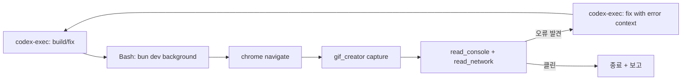

# Browser Automation Patterns for AI Agents

## Overview

Reference guide for AI-controlled browser automation patterns, focusing on integration with Claude Code and MCP-based browser tools.

## Patterns

### 1. MCP-based Browser Control (Recommended)

Use MCP tools (`mcp__claude-in-chrome__*` or `mcp__playwright__*`) for browser interaction:

```
Agent → MCP tool call → Browser extension/Playwright → Page interaction
```

**Advantages**: Native integration, no external dependencies, permission-controlled.

### 2. Cookie-Based Authentication

For testing authenticated flows, import cookies from a real browser session:

```bash
# Export cookies from browser (DevTools → Application → Cookies)
# Import into Playwright context for authenticated testing
```

**Use case**: QA testing of authenticated pages without re-implementing login flows.

### 3. Anti-Bot Stealth Patterns

When automating against sites with bot detection:
- Use realistic viewport sizes and user agents
- Add human-like delays between actions
- Randomize mouse movement patterns
- Respect robots.txt and rate limits

**Caution**: Only use for authorized testing on your own applications.

### 4. Cross-AI Vendor Orchestration

Multiple AI agents can share browser sessions via:
- Shared MCP server connection
- ngrok tunnels for remote access (scoped tokens for security)
- Agent Teams (R018) for coordination

## Tools Available in oh-my-customcode

| Tool | Scope | Configuration |
|------|-------|---------------|
| `mcp__claude-in-chrome__*` | Chrome DevTools Protocol | MCP server in settings |
| `mcp__playwright__*` | Playwright automation | MCP server in settings |
| `playwright-compress` | Output compression (Layer 4) | PostToolUse hook |

## Security Considerations

| Concern | Mitigation |
|---------|-----------|
| Credential exposure | Never hardcode credentials; use env vars or cookie import |
| External data transmission | R001 compliance — no PII to external services |
| Rate limiting | Respect target site limits; implement backoff |
| Scope creep | Only automate your own applications or authorized targets |

## References

- [garrytan/gstack](https://github.com/garrytan/gstack) — /browse, /pair-agent patterns
- [playwright.dev](https://playwright.dev) — Official Playwright documentation
- [Chrome DevTools Protocol](https://chromedevtools.github.io/devtools-protocol/) — CDP reference

## Codex-Claude Build+Verify 협업 루프

[scout:integrate #1009] Codex Browser Use 패턴을 oh-my-customcode 도구 조합으로 매핑한 루프.

### 사용 사례

- 프론트엔드 빠른 프로토타이핑 (Codex가 생성 → 시각 확인 즉시)
- AI 디자인 검증 (의도와 실제 렌더링 차이 발견)
- 회귀 검증 (변경 후 콘솔/네트워크 오류 감지)

### 루프 구조



### 코드 예시

```bash
codex-exec "Add a /dashboard route with sidebar nav"
bun dev &
DEV_PID=$!
# Claude session: mcp__claude-in-chrome__navigate http://localhost:5173/dashboard
# mcp__claude-in-chrome__gif_creator + read_console_messages + read_network_requests
# Loop with codex-exec on errors, max 3 iterations
kill $DEV_PID
```

### 종료 조건

| 조건 | 결과 |
|------|------|
| console error 0 + network failure 0 | 성공 종료 |
| 동일 오류 2회 반복 | 종료 + 사용자 보고 |
| 3회 루프 도달 | degeneration 방지 강제 종료 |

### 도구 매핑

| Codex Browser Use | oh-my-customcode |
|-------------------|------------------|
| Codex 빌드 | `codex-exec` skill |
| Browser Use | `mcp__claude-in-chrome__*` MCP |
| Visual verify | `gif_creator` + console/network |
| Orchestration | 본 루프 패턴 |

### 차별점 (원본 vs 적용)

| Codex Browser Use 원본 | oh-my-customcode 적용 |
|----------------------|----------------------|
| 단일 통합 플러그인 | 도구 조합 (codex-exec + chrome MCP) |
| 자동 무한 루프 | 3회 하드캡 (degeneration 방지) |
| Browser Use 사용 | claude-in-chrome MCP 사용 |

### 참고

- 스킬: `.claude/skills/codex-exec/SKILL.md` "Browser Verify Workflow" (#1009 동시 추가)
- 출처: https://x.com/jameszmsun/status/2047522852854026378 (scout #1009)
